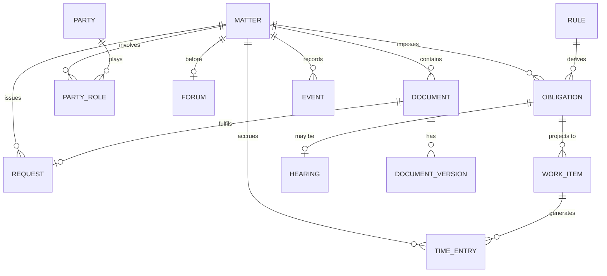

# Pattern Library

**Standing Academy asset. Permanent. Version 1.0.**

The Pattern Library holds the durable design knowledge the Academy has established about professional-services systems. Patterns are stated as principles that can be re-expressed from first principles on any stack. No implementation is carried forward, and no pattern depends on knowing which study produced it.

> **Standing rule.** Patterns are promoted here by S9 of [LREF-01](../LREF-01/LREF-01-Methodology.md). The eight categories below are **fixed** — a new study assigns its patterns to existing categories so that findings from different subjects remain comparable and collidable. Adding a category is a §14 amendment.

## Accumulation status

| Status | Meaning |
| --- | --- |
| **Observed** | Established by a single study. Sound, but not yet independently corroborated |
| **Confirmed** | Independently observed in two or more subjects. The strongest class |
| **Contested** | Contradicted by a later subject. Annotated with the conditions under which each reading holds |

Every pattern below is currently **Observed**, evidenced by CS-001. The second study is what promotes them.

---

## 1. Business patterns

| Code | Pattern | Statement |
| --- | --- | --- |
| **BP-1** | Tri-perspective system | One matter record, three coherent projections: firm operator (portfolio, capacity, revenue), matter worker (my work, my deadlines), matter participant (my case, what is needed from me). Not three products — one model seen from three positions |
| **BP-2** | Client as participant, not recipient | Clients do work: they supply documents, answer questions, make decisions, approve strategy. A system that treats the client as a read-only audience discards the cheapest available labour and the fastest available information |
| **BP-3** | Obligation-first practice management | The law imposes obligations; obligations carry dates, authorities and consequences; work exists to discharge them. Model obligations first and derive tasks and calendar entries from them. Modelling tasks first inverts the domain and cannot be corrected downstream |
| **BP-4** | Closed-loop collection | Any request for something from someone is an object with a due date, a chase policy, an arrival validation and a visible resolution. Requests that are not objects become chase load |
| **BP-5** | Vocabulary as infrastructure | Controlled vocabularies with defined transitions are a precondition for analytics, automation, retrieval and machine classification. Treat them as schema: govern centrally, version deliberately |
| **BP-6** | Instrument before you improve | Ship the measurement with the feature. A system that cannot demonstrate its effect cannot be justified, tuned, or safely automated |
| **BP-7** | Specialisation over one flat record | Matter as an abstract type with per-practice-area specialisations, each holding its distinctive structure without polluting the base. A single generic record serves no real practice well |

---

## 2. UX patterns

| Code | Pattern | Statement |
| --- | --- | --- |
| **UX-1** | Workspace, not record view | For the central object, build a place where work happens — context, conversation, evidence and next actions together — not a page that displays fields |
| **UX-2** | Strict-subset role navigation | Each role's navigation is a proper subset of the tier above. Learnable, explicable, and it makes permission reasoning visible in the interface itself |
| **UX-3** | Matter-first information architecture | Primary navigation follows how practitioners think (*this file*), not how the database is organised (*all documents*). Entity views are secondary lenses |
| **UX-4** | In-context request-and-fulfil | Requests appear where the conversation is, resolve where they appear, and leave provenance behind |
| **UX-5** | State-encoding visual language | Colour, iconography and typography encode state and consequence, not decoration. Always pair with a non-colour channel for accessibility |
| **UX-6** | Observed-behaviour defaults | Defaults encode the empirically common case. A default chosen from observed usage is a design asset; one chosen for symmetry is a tax |
| **UX-7** | Explain the denial | Never silently hide an unavailable action. Disable it, state why, and name who can grant it. Silent hiding teaches users the system is arbitrary |
| **UX-8** | Instructive empty states | An empty state teaches the next action rather than reporting emptiness |
| **UX-9** | Consequence-ranked attention | Order by what happens if ignored, never by recency |
| **UX-10** | Numbers travel with their comparison | Never display a metric without its trend, target or threshold. A naked number is not information |
| **UX-11** | Conversation for retrieval, surfaces for approval | Dialogue for synthesis and instruction; visual, deliberate surfaces for consequential decisions |

---

## 3. Workflow patterns

| Code | Pattern | Statement |
| --- | --- | --- |
| **WF-1** | Derive, don't ask | If the system can compute it from what it already knows, it must not ask a human to type it. The highest-value workflow principle in the library |
| **WF-2** | Every completion emits an event | Finishing something should unblock, trigger, record and bill. A system whose workflows all terminate is a store, not an operating system |
| **WF-3** | Draft-first execution | For any generatable artifact, the system attempts it and the human reviews. Converts the human's job from production to judgement |
| **WF-4** | Escalation as first-class policy | Every obligation carries a chase and escalation policy. Silence is a state that must trigger action |
| **WF-5** | Acceptance criteria as contract | Delegated work states its completion condition. Essential for human review; mandatory for agent self-verification |
| **WF-6** | Approve, never auto-commit | Anything reaching a client, a court or an invoice requires named human adoption |
| **WF-7** | Reversibility by default | Every automated action is reversible, and the reversal is itself recorded |

---

## 4. Entity model

The reference abstraction against which S6 compares a subject's domain model.

### The seven modelling rules

| Code | Rule |
| --- | --- |
| **EM-1** | **Everything dated belongs to a matter.** No orphan deadlines, ever |
| **EM-2** | **Every classification is a controlled vocabulary.** No free-text enumerations |
| **EM-3** | **Every role is contextual.** A person's role is per matter, not global. The same person may be client on one file, witness on another, adverse director on a third |
| **EM-4** | **Every state change is an event.** Append-only; current state is a projection |
| **EM-5** | **Every date states its authority.** A derived date without its source is unusable and indefensible |
| **EM-6** | **Every document carries a procedural type, a version and a privilege class** |
| **EM-7** | **Nothing is deleted.** Supersede, close, archive, destroy under policy — never delete |

### Matter lifecycle

A matter is a long-lived entity and must be able to end properly. Lifecycle states are a controlled vocabulary (EM-2) with defined transitions, each transition an event (EM-4):

**Prospective → Open → Active → Stayed / Suspended → Concluded → Closed → Archived → Destroyed (under retention policy)**

Deletion appears nowhere in the sequence. A system that cannot represent closure will express closure as deletion, which in a regulated practice converts routine operation into evidence destruction.

### Document and evidence organisation

Documents are classified **procedurally**, not by office category. The taxonomy is domain vocabulary and belongs under BP-5: pleading, motion, affidavit, order, judgment, exhibit, discovery request, discovery response, expert report, correspondence, filing receipt, power of attorney, engagement letter.

Each document carries a version chain, a privilege classification (SEC-3), an execution and filing state, a retention class, and — where applicable — an exhibit number. Evidence organisation is the composition of these attributes, not a separate subsystem.

---

## 5. Dashboard concepts

| Code | Concept | Principle |
| --- | --- | --- |
| **DB-1** | Generated brief | Prose over charts for the daily surface: what changed, what is at risk, what needs you, what was handled |
| **DB-2** | Risk board | Everything at risk, ranked by consequence × proximity, across all matters |
| **DB-3** | Matter health | Progression, stall detection, responsiveness, budget variance — per file |
| **DB-4** | Capacity | Real workload derived from obligations, not headcount from a directory |
| **DB-5** | Client health | Responsiveness, sentiment, outstanding requests, time since contact |
| **DB-6** | Economics | WIP, realisation, collection, write-offs, profitability by matter type |

> **Governing rule.** A dashboard exists to change a decision. If no decision changes as a result of viewing it, delete it.

Fabricated or placeholder figures are prohibited without exception. A single invented metric destroys trust in every real metric beside it (see [LL-07](./Lesson-Library.md#ll-07--fabricated-data-is-contagious)).

---

## 6. Navigation concepts

| Code | Concept | Principle |
| --- | --- | --- |
| **NAV-1** | Matter-first primary IA | Navigate to a file, not to a table |
| **NAV-2** | Entity views as lenses | Cross-matter views are secondary, filtered projections |
| **NAV-3** | Persistent role-scoped rail | Strict subsets, with active-state indication |
| **NAV-4** | Global semantic search | One input, all matters, natural language, permission-filtered |
| **NAV-5** | Recents and pinned matters | Practitioners work a small hot set — make it one click |
| **NAV-6** | Command surface | Keyboard-first action invocation for power users |
| **NAV-7** | Context preservation | Moving between views retains matter scope |
| **NAV-8** | Deep-linkable everything | Every object addressable, shareable and citable |

Entity-first navigation is a symptom, not a style choice: it usually reifies a join the data model failed to make. Where it appears, treat it as a modelling finding (see [I-17](../LREF-01/LREF-01-Methodology.md), Navigation Axis Test).

---

## 7. Role model

Two orthogonal layers.

**Organisational roles** — who someone is: Firm Administrator · Partner · Associate · Paralegal · Support · Client · External Counsel · Expert.

**Capabilities** — what someone may do: View · Create · Edit · Delete · Assign · **Request** *(place an obligation on another party)* · Approve · Sign · Bill · Administer.

**Scopes** — over what: Global · Practice group · Matter · Own work.

**Composition.** A permission is a capability, over a scope, granted to a role or an individual, subject to ethical walls, evaluated server-side, and applied identically to humans and to agents acting on their behalf.

| Code | Rule |
| --- | --- |
| **ROLE-1** | **Capabilities compose; role ladders do not.** Build capability infrastructure before the features that need it, or it degrades into scattered conditionals |
| **ROLE-2** | **Scope is as important as capability.** "Can edit" is meaningless without "which matters" |
| **ROLE-3** | **Agents inherit, never exceed.** An agent's authority is exactly the invoking human's authority, and every exercise is attributed to that human |

---

## 8. Security and governance

| Code | Concept | Statement |
| --- | --- | --- |
| **SEC-1** | Server-side authorization only | The client is a rendering surface. Every decision is made and enforced server-side, per record |
| **SEC-2** | Ethical walls as infrastructure | Matter-level confidentiality that overrides role. Screened personnel cannot see screened matters — enforced, not conventional |
| **SEC-3** | Privilege as a data attribute | Every document carries a privilege classification governing access, disclosure and export |
| **SEC-4** | Append-only by default | No hard deletes. Supersession, closure, retention and policy-driven destruction with recorded authority |
| **SEC-5** | Complete audit | Every read of privileged material, every write, every agent action — actor, time, authority, justification |
| **SEC-6** | Confidentiality boundary integrity | Privileged content never renders, transits or is processed outside the trust boundary |
| **SEC-7** | Invitation-only identity | The firm provisions accounts, roles and matter access. No self-service registration |
| **SEC-8** | Time-bounded client access | Client access is matter-scoped and expires at matter closure, automatically |
| **SEC-9** | Credential material never leaves the server | No password value returns to any client under any circumstance |
| **SEC-10** | Blocking guardrails | Safety controls prevent, they do not warn. An unverified citation does not raise an advisory — it prevents release |
| **SEC-11** | Attribution on every artifact | Human or agent, and which accountable human. No anonymous output |
| **SEC-12** | Explicability of derived facts | Every computed date, flag or score states its authority and inputs. Unexplainable outputs are unusable in a professional context |

### Activity timeline

The append-only event stream (EM-4) is the substrate for three distinct surfaces, which must not be built separately:

| Surface | Audience | Derived from |
| --- | --- | --- |
| Matter activity timeline | Practitioners — what has happened on this file | Events scoped to one matter |
| Audit ledger | Governance and regulators — who did what, under what authority | SEC-5, complete and immutable |
| Client-visible history | Matter participants — progress and what is needed | Events filtered by SEC-8 and SEC-3 |

One stream, three permission-filtered projections. Building them independently guarantees they diverge.

---

## Capability coverage

Where each approved operational capability is canonically held. This table exists so that integration is auditable; it is not a second source of truth.

| Capability | Canonical location |
| --- | --- |
| Matter lifecycle | §4 — Matter lifecycle; EM-4, EM-7 |
| Obligation register | BP-3; §4 entity model; WF-4 |
| Matter-centric navigation | UX-3; NAV-1, NAV-2 |
| Document request workflow | BP-4; UX-4 |
| Client communication workflow | BP-2; UX-11; SEC-8 |
| Activity timeline | §8 — Activity timeline; EM-4; SEC-5 |
| Matter status model | §4 — Matter lifecycle; BP-5; EM-2 |
| Evidence organisation | §4 — Document and evidence organisation; EM-6; SEC-3 |
| Dashboard concepts | §5 — DB-1…DB-6 |
| Operational workflow | §3 — WF-1…WF-7 |
| Permission concepts | §7 — ROLE-1…ROLE-3; SEC-1, SEC-2 |
| Productivity patterns | WF-1, WF-3; NAV-5, NAV-6 |
| Operational UX | §2 — UX-1…UX-11 |
| Reusable interaction patterns | UX-4, UX-7, UX-8, UX-9 |
| Information architecture | UX-3; §6 — NAV-1…NAV-8 |

---

## Evidence

All patterns in v1.0 are evidenced by **CS-001**, registered in the [case study register](../LREF-01/README.md#case-study-register). Per §12 of the methodology, single-subject observation does not confer *confirmed* status.

*The Pattern Library is a controlled document. Category changes require board approval (LREF-01 §14).*
