# CaseAce — Product Reverse Engineering & Archaeology Report

**Subject system:** `derekgan08/CaseAce-law-firm-management-system-frontend`
**Engagement:** Extraction of reusable product, domain, workflow and UX intellectual property in service of a next-generation AI-native law firm operating system ("Rafter OS")
**Posture:** Product archaeology — *not* code review, *not* refactoring, *not* contribution
**Date of analysis:** August 2026
**Classification:** Internal strategy document

---

## 0. How To Read This Document

This report treats CaseAce as an **artifact of intent**, not as software. The question is never "is this code good?" — it is *"what did four intelligent people, given six weeks and a real problem statement, decide a law firm needed?"* Their answers — including the wrong ones — are the asset. A wrong answer that took six weeks to produce is cheaper to learn from than to rediscover.

Three rules govern the analysis:

1. **We mine decisions, not implementations.** Every finding below is expressed as a product or domain assertion that survives being rewritten in any language, on any stack.
2. **Absence is evidence.** What a law-firm system *fails* to model tells us more about the designers' mental model than what it models well. Half this report is about things that are not there.
3. **Defects are specifications in disguise.** Where CaseAce is broken, it is usually broken along a fault line that reveals a genuine, hard, unsolved domain problem. Those fault lines are where Rafter OS earns its value.

### 0.1 Intellectual property advisory — read before reuse

The subject repository carries a **custom "All Rights Reserved" licence**, not an open-source licence. Its terms purport to forbid copying, storing, adapting and creating derivative works without written permission.

Accordingly, this engagement has been conducted, and this report has been written, under a strict discipline:

| Permitted and performed | Prohibited and not performed |
| --- | --- |
| Reading the public repository to understand product intent | Copying source code into any Rafter artifact |
| Extracting **abstract ideas**: domain concepts, workflow shapes, role models, screen taxonomies, naming vocabulary | Reproducing markup, stylesheets, scripts or file structure |
| Recording **facts** about the system: field names, enum values, endpoint paths, metric labels | Reusing the authors' logo, brand, copy or visual assets |
| Independent critique and redesign | Submitting pull requests or modifications upstream |

Ideas, systems, methods of operation, domain vocabulary and facts are not protected by copyright; expression is. **Every reusable asset in Phase 10 is an abstraction, and must be re-expressed from first principles in any Rafter implementation.** No line of CaseAce may be carried across. Where this report quotes an identifier (e.g. `case_member_role`), it does so as *evidence of a design decision*, in the manner of a citation — not as a component to be transplanted.

### 0.2 Evidence base

| Evidence source | Volume | Weight assigned |
| --- | --- | --- |
| Application source (PHP page shells, jQuery controllers, CSS) | 86 files, ~15,200 lines | Primary — reveals what was *actually built* |
| Authors' own UML: user model, use-case model, class diagram, 5 sequence diagrams, architecture and module diagrams | 17 rendered figures | **Primary — reveals what was *intended*, which is the more valuable signal** |
| README specification (problem statement, objectives, module charters, design rationale) | ~20 KB prose | Primary — reveals the *product thesis* |
| Version history | 21 commits, 4 contributors, 2 Dec 2023 → 20 Jan 2024 | Secondary — reveals process and team topology |
| Hi-fidelity prototype screens | 4 screens (Case grid, Case list, Document overview, Document detail) | Secondary — reveals UX ambition beyond what shipped |

The **gap between the intended system (UML + README + prototype) and the delivered system (code)** is itself one of the richest findings in this report, and is treated as a first-class object of study throughout.

---

## Executive Summary

### The one-paragraph verdict

CaseAce is a competently conceived, honestly documented, six-week academic capstone that **correctly identified law-firm coordination as a product category and then modelled a law firm as if it were a software team.** It ships Cases, Tasks, Appointments, Documents, Clients and Notifications — the vocabulary of project management wearing legal clothing. What it does not ship is *law*: there is no hearing, no court, no jurisdiction, no limitation period, no opposing party, no matter number, no conflicts check, no engagement letter, no time entry and no rate. Its headline promise — "never miss a court date" — is structurally unfulfillable, because **the Task and Appointment entities carry no foreign key to a Case.** Deadlines float free of the matters that give them meaning. That single omission is the most instructive artefact in the repository: it is precisely the seam where a generic productivity tool fails to become a legal system, and precisely where an AI-native successor must do its most important work.

### The seven findings that matter

| # | Finding | Consequence for Rafter OS |
| --- | --- | --- |
| **F1** | **Deadlines are orphaned.** Neither Task nor Appointment carries a case reference. The "court date alerts" objective cannot be satisfied by the data model that was built. | The atomic unit of a legal OS is not a task — it is an **Obligation** bound to a matter, a source of law, and a computed date. Model it first. |
| **F2** | **"Hearing" does not exist.** The README names court hearings as the motivating use case; the domain model has no hearing entity. A hearing is an Appointment with a free-text `location` string. | Hearings, filings and limitation dates are *different species* from meetings. They have legal consequence, a triggering rule, and a non-negotiable date. Give them their own entity. |
| **F3** | **The best idea in the repository is the in-matter document request loop.** A chat message becomes a first-class request object; the client uploads *against* that request; the request visibly resolves. Closed-loop, in-context, auditable. | **Keep and generalise this.** It is the seed of every agent-driven collection workflow: evidence, discovery responses, client documents, insurer disclosures. |
| **F4** | **Vocabulary is uncontrolled by design.** `case_status`, `case_priority` and `case_type` are free-text inputs, while dashboards hardcode `open`/`closed`/`pending`. Any case typed "In Review" silently disappears from management reporting. | A legal OS is a **controlled-vocabulary system**. Statuses, document types and party roles must be enumerations with lifecycle rules, or analytics and automation are both impossible. |
| **F5** | **Authorization is a string in `localStorage`.** Role gating is achieved by hiding DOM elements based on a client-held value. Two places got it right (a server-issued `canEdit` flag on documents, a server-issued `isAdmin` flag on appointments) — proving the team knew better. | For privileged and confidential material this is disqualifying. Authorization must be server-side, per-record, and — for a law firm — **ethical-wall aware**. The two correct implementations are the pattern to generalise. |
| **F6** | **Billing is a single integer with no rate.** `case_total_billed_hour` exists; hourly rate, time entries, invoices, trust accounting and expenses do not. The system can count hours but cannot produce money. | Revenue is not a reporting feature bolted onto a case record. Time capture must be an **event stream**, and in an AI-native system most of it should be **observed, not typed**. |
| **F7** | **The delivered system is ~60% of the designed system, and the design was better than the build.** The UML models Roles as a first-class entity with an access array; the code has none. The prototype shows a rich case grid with upcoming activities; the build shows a five-column table. | The authors' *design artefacts* are the higher-value asset. Mine the diagrams harder than the code — and note the failure mode: **unspecified enums and unenforced relationships silently degrade during implementation.** |

### Maturity verdict

| Dimension | Assessment |
| --- | --- |
| **Stage** | High-fidelity **conceptual prototype**. Not alpha, not MVP. |
| **Deployability** | **Zero.** Frontend origin, API origin and websocket origin are hardcoded to `localhost:3000` / `localhost:6500`. A `.env` loader is declared as a dependency and never used. Despite a README architecture diagram specifying Vercel + Heroku + MongoDB + Cloudinary, nothing is environment-driven. |
| **Completeness** | Approximately 60% of the specified system. Two of five dashboard charts render hardcoded fake data; the Task analytics module filters on a status value tasks can never hold; six screens carry copy-pasted `<title>` tags from other screens. |
| **Team topology** | Four contributors, one module each — and the seams are visible in the artifact. **Conway's Law is legible in the codebase**: the Task module is a partially-renamed fork of the Appointment module; the Employee module is a fork of the Client module that still greets the user with "Client Details". |
| **Genuine achievements** | The requirements engineering (user model, use-case model, class diagram, module charters) is of a standard many funded startups never reach. The document-request protocol is a real product invention. The role→navigation matrix is clean and reusable. |

### Strategic implication in one line

> **CaseAce is a system of *coordination*. Rafter OS must be a system of *obligation and reasoning*.**
> Coordination asks "who is doing what by when." Legal practice asks "what does the law require of this matter, by when, on what authority, and what happens if we are wrong." CaseAce never asks the second question. Everything in Phases 6–8 of this report follows from closing that gap.

---

# PHASE 1 — Product Discovery

## 1.1 Product vision (as stated, and as revealed)

**As stated** (README, verbatim in substance):

> Law firms without an integrated system struggle with missing deadlines, tracking case details, and managing client information — producing inefficiency, miscommunication and delay. CaseAce is a web-based system that helps law firms manage staff tasks, track case deadlines, view case information, and receive alerts for important events such as court dates.

**As revealed by the artifact:** the vision that was actually pursued is narrower and more honest than the vision that was written down:

> *A shared operational surface where a small law firm, its staff and its clients can see the same cases, the same documents, the same calendar and the same task board — replacing email and paper as the coordination substrate.*

The distance between these two statements is the product's central tension. The stated vision promises **deadline safety** ("never miss a court date"). The delivered vision provides **shared visibility**. Visibility is a precondition for deadline safety, but it is not the same thing — and the entities required for the second were never built.

### The vision decomposed

| Vision component | Stated? | Built? | Assessment |
| --- | --- | --- | --- |
| Shared case visibility across staff and clients | Yes | **Yes** | Genuinely delivered. Three role-specific navigations over one case record. |
| Document centralisation | Yes | **Yes** | Delivered, including client-side upload. |
| Client portal / client as first-class user | Implicit | **Yes** | Notable and unusual for 2023-era student work. A real differentiator. |
| Task distribution and progress tracking | Yes | **Partly** | Kanban board works; assignment works; but tasks are not attached to matters. |
| Appointment scheduling with invitations and responses | Yes | **Yes** | The most complete module. Accept/decline with per-attendee state is properly modelled. |
| **Deadline tracking and alerts** | **Yes — headline** | **No** | No deadline entity, no rule engine, no escalation, no case linkage. Notifications are event echoes, not warnings. |
| **Court date / hearing management** | **Yes — headline** | **No** | No hearing entity. No court, judge, docket or jurisdiction anywhere in the model. |
| Client satisfaction measurement | Yes (module charter) | **No** | A five-dimension satisfaction radar chart renders on the dashboard. No screen anywhere lets a client submit a rating. The measurement instrument does not exist. |
| Case history / interaction timeline | Yes (module charter) | **No** | A `related_case_history` field is fetched from the API and never rendered; its markup is commented out. |
| Billing | Weakly implied | **No** | One integer field. No rate, no time entry, no invoice. |

**Three of the four headline promises are unbuilt.** This is the defining characteristic of the product and the single most important lesson it teaches: *a system can look complete, demo well, and satisfy none of its stated objectives, if the objectives were never translated into entities.*

## 1.2 Target users

The product targets a **small-to-mid boutique law firm** — inferred, not stated, from four converging signals: a flat two-tier staff hierarchy with no departments or practice groups; firm-wide dashboards that assume every partner may see every case (no ethical walls, no case-level confidentiality); benchmark figures baked into the UI implying a firm of roughly 45 users, 23 employees and 36 cases; and a client portal, which large firms typically buy separately and boutiques want bundled.

**Not targeted, and structurally excluded:** solo practitioners (the entire model presumes delegation), large firms (no matter numbering, no conflicts, no trust accounting, no practice groups), in-house legal departments (no legal-spend or outside-counsel concepts), and litigation-heavy practices (no court, docket or procedural calendar).

The last exclusion is the sharpest irony: the marketing promise is court-date safety, and litigation practice is the one segment the data model cannot serve.

## 1.3 User roles

Two role systems coexist in the artifact, and understanding the difference between them is the single most transferable insight in this phase.

### System A — Organisational roles (implemented)

Five string values: `admin`, `partner`, `associates`, `paralegal`, `client`. These collapse into **three navigation personas**:

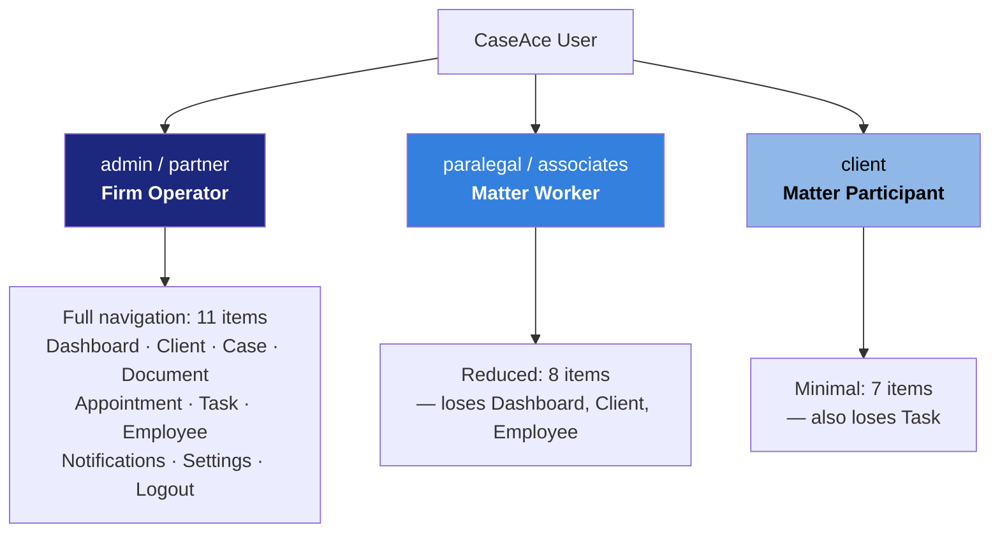

The reduction is **strictly nested** — each persona's navigation is a subset of the one above it. This is a clean, comprehensible model and is recommended for reuse (Pattern **UX-2**, Phase 10).

Two defects are worth recording. First, `associates` — a fee-earning lawyer — is grouped with `paralegal` for navigation, then separately granted case-edit rights, and separately denied the dashboard. The role is *incoherent*: the system cannot decide whether an associate is a lawyer or support staff. Second, two different role allowlists exist in the same helper file — one accepting five roles, one accepting three — so a `partner` can pass one authorization check and fail the other.

### System B — Capability roles (designed, never implemented)

The authors' user-modelling diagram defines a **second, orthogonal layer** that the code never received:

| Capability role | Meaning |
| --- | --- |
| Case, Document **Viewer** | Read access |
| Case, Document **Creator** | Origination rights |
| Case, Document **Editor** | Mutation rights |
| Document **Uploader** | Contribution rights |
| Document **Requester** | Right to compel a counterparty to produce |
| Task **Viewer** | Sees assigned work |
| Task **Assigner** | Delegates work |

Organisational roles are then composed from capabilities: a Partner is Creator + Editor + Assigner + Requester; a Client is Viewer + Uploader only.

**This is the correct model, and its loss during implementation is the most consequential regression between design and build.** The class diagram reinforces it — a `Roles` entity with a `role_access: array` field is specified, then never built. What shipped instead was a hardcoded ladder of `if (userType !== 'admin' && userType !== 'partner')` checks scattered across nine screens.

The lesson generalises well beyond this repository: **capability models degrade into role ladders under implementation pressure, because a role ladder is expressible as an `if` statement and a capability model requires infrastructure.** Rafter OS must build the infrastructure first, or it will suffer the identical regression. `Document Requester` in particular is a genuinely sophisticated concept — the right to place an obligation on another party — and it is exactly the permission an autonomous agent will need to hold and to be constrained by.

## 1.4 Business goals

| # | Goal (stated or inferred) | Instrumented? | Verdict |
| --- | --- | --- | --- |
| G1 | Eliminate missed deadlines and court dates | No | **Not achievable** — no deadline entity, no case-linked dates, no escalation logic |
| G2 | Reduce coordination overhead (email/paper displacement) | No | Plausibly achieved by the shared-surface design |
| G3 | Improve document turnaround from clients | Partly | The request loop is a genuine mechanism; no cycle-time metric exists |
| G4 | Increase staff utilisation / workload balance | No | "Cases Assigned per lawyer" is displayed as a hardcoded constant |
| G5 | Improve client satisfaction | Displayed only | Five-dimension radar chart with no collection instrument |
| G6 | Give partners firm-wide operational visibility | Partly | Dashboard exists; two of five charts are fabricated data |

**The instrumentation gap is total.** Every metric a partner would use to judge whether the system is working is either hardcoded, fabricated, or uncollectable. This is not merely a build shortcut — it reflects an unexamined assumption that *visibility equals improvement*. A modern legal OS must ship with its measurement instruments as first-class, or it cannot demonstrate ROI and cannot be safely automated (you cannot supervise an agent whose effect you do not measure).

## 1.5 Core value proposition

**As positioned:** "One place for cases, tasks, documents, appointments and clients — so nothing gets missed."

**As actually delivered:** *"A shared, role-filtered window onto matter state, with a working closed-loop mechanism for getting documents out of clients."*

The proposition is **coordination-grade, not practice-grade**. It competes with Trello-plus-Dropbox-plus-a-shared-calendar, and would win on integration. It does not compete with practice management systems, because it cannot answer any question a practitioner actually asks under pressure: *What is due next and why? What is the limitation date? Have we cleared conflicts? What is this matter worth? Who is on the other side? What did we tell the client last?*

### Value assessment of the five modules

| Module | Differentiation | Assessment |
| --- | --- | --- |
| Document Management | **High** | The in-matter request/fulfil loop is a real invention. Preserve it. |
| Appointment Management | Medium | Per-attendee response state is properly modelled — the most complete module in the system. |
| Case Management | Low | A record with a member list. No legal semantics. |
| Task Management | Low | A generic Kanban board, forked from Appointments and partially broken. |
| CRM | **Negative** | Client and Employee are the same entity behind two identical screens; the satisfaction and history features are UI without substance. |

## 1.6 Primary workflows

Seven workflows are genuinely operational, and their relative sophistication is diagnostic:

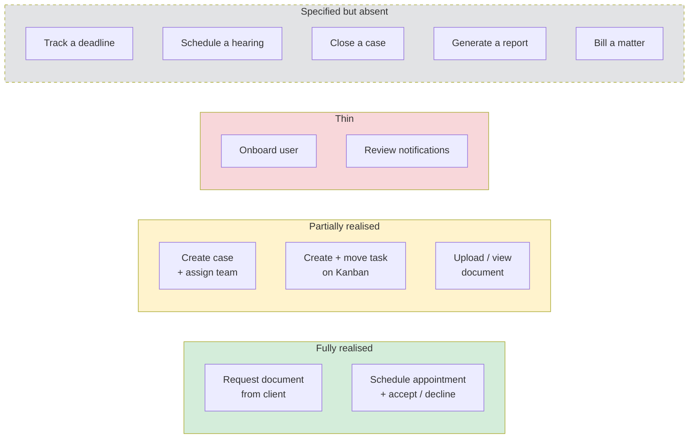

Two observations carry forward.

**There is no case lifecycle.** A case is created and can be edited or deleted. It is never *opened*, *progressed*, *stayed*, *settled*, *closed*, or *archived*. "Archived Cases: 12" appears on the case dashboard as a hardcoded number describing a state the system cannot represent. A matter in CaseAce has no arc — and legal practice is almost entirely about the arc.

**Deletion substitutes for lifecycle throughout.** Cancelling an appointment issues an HTTP `DELETE`. Deleting a case issues a `DELETE`. There is no cancellation state, no reason code, no tombstone, no audit trail. For a professional services firm operating under retention duties, professional-conduct obligations and discovery exposure, **hard deletion is the single most dangerous design decision in the system.** Rafter OS must be append-only at its core (Pattern **SEC-4**, Phase 10).

## 1.7 Product maturity

```
Napkin ──── Prototype ──── [CASEACE] ──── MVP ──── Product ──── Platform
                              ▲
              Specification-complete, deployment-incapable
```

**Positioning: high-fidelity conceptual prototype.** Above prototype because the requirements engineering, module decomposition and interaction design are genuinely thorough. Below MVP because it cannot be deployed, cannot be secured, and does not fulfil its own stated objectives.

| Signal | Evidence | Reading |
| --- | --- | --- |
| Timeline | 21 commits, 2 Dec 2023 → 20 Jan 2024 | ~6 working weeks |
| Team | 4 contributors, ~1 module each | Parallel development, no integration phase |
| Integration debt | Task module is a partially-renamed fork of Appointment; Employee is a fork of Client | **No convergence pass was ever run** |
| Configuration | Origins hardcoded in three places; `phpdotenv` declared and unused | Never left the developers' machines |
| Test posture | `npm test` → `Error: no test specified` | No verification layer of any kind |
| Data honesty | 2 of 5 dashboard charts, and every metric tile on 4 screens, are hardcoded | Demo-oriented, not data-oriented |
| Documentation | 17 UML figures, module charters, design rationale, references | **Well above the norm** — the strongest dimension |

### The signature pathology

The clearest structural finding in the repository is **fork-and-rename module duplication**, and it is worth naming precisely because it recurs in commercial products:

- The Task module was created by copying the Appointment module. Task screens still use `appointment-` DOM identifiers. The Task analytics chart still filters records for `status === 'scheduled'` — a value no task can ever hold, since tasks are `todo`/`working`/`done`. **The task charts therefore report zero, permanently, by construction.**
- The Employee module was created by copying the Client module. It still calls the client API endpoint for deletion, and still greets the user with "Client Details".

This is Conway's Law rendered in source: four people, four modules, no shared abstraction, no integration pass. The transferable lesson is stated in Phase 9 as a teaching exercise, because it is the most reliably instructive failure in the entire artifact — **a fork that is 95% renamed is more dangerous than one that is 0% renamed, because it passes review.**

---

# PHASE 2 — Domain Model

## 2.1 The model as built

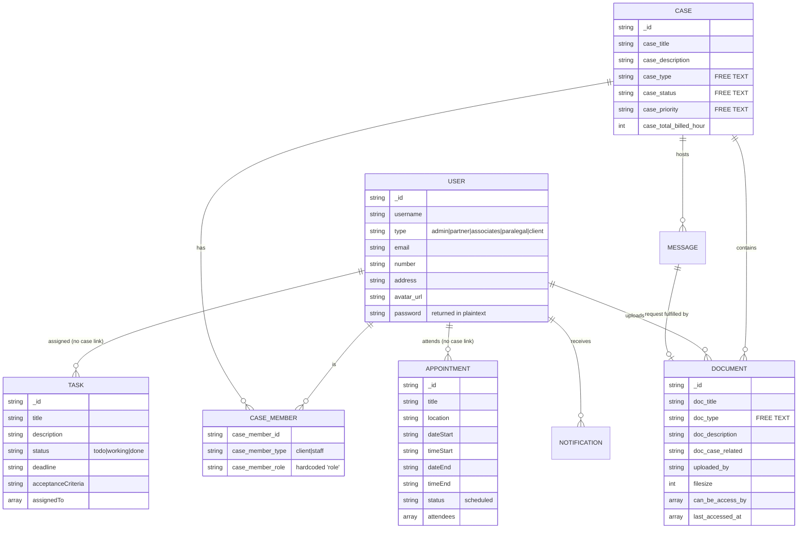

**Read the dotted absences, not the boxes.** Task and Appointment hang off User alone. Nothing in the schema connects a deadline to a matter.

## 2.2 Entity-by-entity analysis

Each entity is assessed on four axes: what it is *for*, how it *relates*, what it is *missing*, and where AI changes its nature.

---

### E1 — CASE (the matter)

**Purpose.** The organising container for legal work: a title, a free-text classification, a member list and an hours counter.

**Relationships.** Owns Documents (via `doc_case_related`) and a chat thread (a socket room keyed by case id). Holds a member list of Users tagged client-or-staff. **Owns no tasks and no appointments.**

**Missing fields — the substantive finding of this report.** A legal matter is not a project. It is a bundle of *obligations, parties, authorities and exposures*. Everything in the right-hand column below is absent:

| Category | Absent from CaseAce |
| --- | --- |
| **Identity** | Matter number, client-matter code, internal reference, external file number |
| **Forum** | Court, instance, jurisdiction, docket/case number, judge, venue, panel |
| **Parties** | Opposing party, opposing counsel, co-defendants, third parties, insurer, expert witnesses, guarantors |
| **Legal substance** | Cause of action, legal basis, claim amount, relief sought, governing law, contract at issue |
| **Time** | Limitation / prescription date, filing deadlines, service dates, procedural stage, next step and its legal source |
| **Lifecycle** | Open date, close date, disposition, outcome, settlement terms, appeal status |
| **Commercial** | Fee arrangement, engagement letter reference, budget, WIP, realisation, write-offs |
| **Governance** | Conflicts-check status and date, responsible partner, ethical-wall flags, retention class, destruction date |
| **Risk** | Exposure estimate, probability of success, reserve, malpractice-risk flag |

The model expresses *who is on the case*. It does not express *what the case is, where it is, who is against us, what is due, or what it is worth*.

**AI enhancement.**
- **Matter classification from intake.** Cause of action, practice area, complexity and probable procedural track inferred from the engagement documents — replacing the free-text `case_type` box entirely.
- **Party and forum extraction.** Court, docket, judge, opposing counsel and claim amount parsed from the first filed document. This is high-accuracy, high-value extraction that eliminates the most tedious data entry in the firm.
- **Obligation derivation.** Given jurisdiction + procedural stage + trigger date, *derive* the deadline set from the rules of civil procedure rather than asking a human to remember it. This is the single highest-value AI function in a legal OS.
- **Conflicts screening at creation.** Semantic (not string) matching of all parties against the historical matter corpus, surfacing adverse and positional conflicts.
- **Matter health scoring.** Continuous assessment from activity, deadline proximity, document flow and client responsiveness — replacing the free-text `case_priority` field with a computed, defensible signal.

---

### E2 — USER / CLIENT / EMPLOYEE (one entity, three screens)

**Purpose.** Every human is one record type discriminated by a `type` string. "Employee" is defined as *any user whose type is not client*.

**Relationships.** Members of cases; assignees of tasks; attendees of appointments; uploaders of documents.

**Missing fields.** For a **person**: title, seniority, bar admission and number, practice areas, languages, supervising partner, availability and capacity, cost rate, billing rate, signature block, out-of-office. For a **client**: entity type (individual/company/partnership), company registration or national ID, VAT number, billing contact, preferred channel and language, KYC/AML status and date, engagement letter reference, credit status, relationship owner, conflicts-check history.

Two absences deserve emphasis. **There is no billing rate anywhere**, which is why the hours counter on Case cannot become revenue. And **there is no distinction between a natural person and a legal entity**, which is a modelling failure that propagates into service rules, conflicts checking and litigation capacity.

Note also the elegant-looking but empty concept: the case member list carries a `case_member_role` field intended to record *what this person is on this case*. It is populated with the literal string `'role'` on every save. **The idea was right and the implementation is a placeholder** — and the idea is important enough to reconstruct (see Pattern **DM-2**, Phase 10). A person's role is not global; it is *per matter*. The same individual may be a client on one file, a witness on another and a director of the opposing company on a third.

**AI enhancement.** Client-communication style profiling (how much explanation this client needs, in what language, at what cadence); capacity-aware assignment using real workload rather than headcount; automated KYC/AML document collection and verification; relationship-risk detection from communication sentiment and response latency; and — importantly — **entity resolution across matters**, so that "Ltd." and "Limited" and a company number are recognised as one party for conflicts purposes.

---

### E3 — TASK

**Purpose.** A unit of assignable work with a title, description, assignees, a deadline, acceptance criteria and a three-state Kanban status.

**Relationships.** Users only. **No case. No document. No dependency on another task.**

**Missing fields.** Case reference (critical); priority — Case has one, Task does not; estimated and actual time; billable flag and billing code; dependencies and blocking relationships; recurrence; a legal source for the deadline; escalation path; completion evidence; reviewer and approval state; delegation history.

Note the naming accident that turns out to be a genuine insight: the Task form's "Acceptance Criteria" field is the Appointment form's "Location" field, renamed but not re-modelled. **Nevertheless, acceptance criteria on a legal task is a good idea that most commercial practice-management systems lack** — it is the field that makes a delegated task reviewable, and it is exactly the field an AI agent needs in order to know when it is finished. Reconstruct it deliberately.

**AI enhancement.** Task generation from matter stage (opening a matter of a given type should *produce* its checklist, not require one); draft-first execution, where the system attempts the task and the human reviews; automatic completion detection from artifacts (the task "file the response" closes when the filing receipt arrives); dynamic re-prioritisation across the firm by deadline risk; and time-estimate learning from historical actuals.

---

### E4 — APPOINTMENT

**Purpose.** A scheduled event with a title, location, start/end date-time, details and an attendee list carrying **per-attendee response state** (`pending` → `accepted` | `declined`).

**Relationships.** Users only. **No case. No client. No matter context.**

**Assessment.** This is the best-modelled entity in the system. Per-attendee response state is genuinely correct modelling — it recognises that an invitation is a distinct object from an event, with its own lifecycle per participant. Keep this shape.

**Missing fields.** Case reference; **appointment type** (client meeting / internal / court hearing / deposition / mediation / site visit / call) — the absence of which is why hearings cannot be represented; billable flag; travel time; preparation-time requirement; conference link; recurrence; agenda; outcome and follow-up notes; and, for hearings specifically, court, judge, courtroom, hearing type, required attendance and the consequences of non-attendance.

**Critically: there is no conflict detection.** The system will cheerfully double-book the same attendee at the same instant. For a practice where a missed or clashing hearing is a professional-liability event, this is a material omission.

**AI enhancement.** Multi-party scheduling that negotiates across constrained calendars; automatic preparation-time blocking sized to hearing type and complexity; agenda generation from matter state; travel-time and buffer insertion from location data; conflict and double-booking prevention; automated meeting minutes; and — the highest-value item — **converting a court listing notice into a calendar entry with its full preparation chain**, which is the daily manual labour of every litigation secretary.

---

### E5 — DOCUMENT

**Purpose.** A file attached to a case, with a title, a free-text type, a description, uploader, size, an access-control list and an access log.

**Relationships.** Belongs to exactly one Case; references an uploading User; can be linked to the chat message that requested it. Carries `can_be_access_by` (an ACL) and `last_accessed_at` (an access history array of which only the first entry is ever read).

**Assessment.** Structurally the most sophisticated entity — it is the only one with a real ACL, a real access log, and a server-issued permission flag. Two of the three good security ideas in the entire system live here.

**Missing fields.** Version and version history; supersedes/superseded-by; execution status (draft / for review / executed / filed / served); signature state and signatories; document date as distinct from upload date; author as distinct from uploader; privilege and confidentiality classification — **the absence of a privilege flag is a serious professional-risk omission**; retention class and destruction date; Bates/exhibit numbering; source and provenance; page count; OCR and text-extraction status; language.

**The document type taxonomy is the wrong taxonomy.** The system ships a seven-category, ~60-value classification: individuals, legal, business, education, realEstate, medical, technology. This is a *generic office document* taxonomy — Passport, Payslip, Lease, EULA, Diploma. It is not a *legal work-product* taxonomy. There is no Pleading, Motion, Affidavit, Exhibit, Court Order, Judgment, Discovery Request, Discovery Response, Expert Report, Correspondence, Engagement Letter, Power of Attorney, or Filing Receipt.

This is diagnostic of the whole product: **the authors classified documents by what they are in the world, not by what they do in a matter.** A legal OS must do the latter, because procedural role — not physical type — determines deadlines, privilege, disclosure obligations and retention.

**AI enhancement.** Automatic classification into a procedural taxonomy on upload; entity, date and obligation extraction; **deadline detection from document content** (an order specifying a response period should create the obligation automatically); privilege detection and flagging; version and near-duplicate detection; cross-document contradiction detection; automatic exhibit numbering and bundle assembly; multilingual summarisation; and completeness auditing against an expected-document checklist for the matter type.

---

### E6 — MESSAGE / DOCUMENT REQUEST (the hidden gem)

**Purpose.** Real-time per-case chat, with three message types: `message`, `request`, and `requested_and_uploaded`.

**Why this matters.** This is the most product-mature idea in the repository. A document request is not a task and not an email — it is a **message that carries an obligation and visibly discharges itself.** The request appears in the matter conversation with a warning icon; the counterparty uploads directly against it; the message transitions to fulfilled and the icon becomes a checkmark; the uploaded document is permanently linked to the request that produced it.

That is a closed loop with in-context provenance, and it is exactly the interaction model that agent-driven work needs.

**Missing fields.** Due date on the request; reminder and escalation policy; partial fulfilment; rejection with reason; a formal request-status enum; threading; read receipts; attachments on ordinary messages; and — a real defect — the request payload is encoded as a single delimited string rather than structured fields, so a title containing the delimiter corrupts the record.

**AI enhancement.** Generating the *right* request list for a matter type rather than asking a human to think of it; drafting the client-facing explanation of why each document is needed and what an acceptable version looks like; validating on receipt that the uploaded file actually is what was requested; automatic escalation on non-response; and closing the loop against a matter-completeness model — *"discovery response is 11 of 14 documents complete; the three outstanding are X, Y, Z; here is the chase message."*

---

### E7 — NOTIFICATION

**Purpose.** An event feed with a type, body text, timestamp, a click-through link and a read flag.

**The taxonomy is entirely reactive.** All eleven notification types report things that *have already happened*: document added, edited, deleted; task assigned, finished; appointment created, updated, cancelled, accepted, declined; attendee removed.

**Not one notification type warns about the future.** There is no "deadline in 3 days", no "limitation period expires in 30 days", no "client has not responded in 10 days", no "hearing tomorrow, preparation incomplete". For a product whose stated purpose is preventing missed deadlines, **the alerting subsystem contains no alerts.**

Compounding this: there is no way to mark a notification read (the read flag is displayed but never set), no unread badge, no grouping, no priority, no delivery channel other than the in-app list, and no user preferences.

**AI enhancement.** This entity should be replaced outright by a **risk-and-attention engine**: predictive rather than reactive, prioritised by consequence rather than recency, aggregated into a daily brief rather than an undifferentiated feed, escalating through channels as consequence severity rises, and learning which signals a given user actually acts on. See Phase 7.

---

### E8 — ROLE / PERMISSION (specified, never built)

The class diagram specifies a `Roles` entity with an identifier, a title, a user array, a creation date and — crucially — an **access array**. This is a proper role-based access-control model.

**None of it exists in the delivered system.** Authorization is a role string in browser storage, consulted by scattered conditionals that hide DOM elements.

Two implementations bucked the trend and they are the pattern to generalise: documents receive a server-computed `canEdit` flag per record, and the appointment module asks the server whether the current user is an administrator rather than trusting the client. **These two are correct. Everything else is theatre.** The gap between the specified `Roles` entity and the delivered `if` statements is the clearest single instance of the design-to-build regression described in Phase 1.

---

### E9 — Entities that exist only as pixels

A distinctive category worth cataloguing, because it recurs in commercial products and is a specific hazard when an AI is later asked to reason over the system:

| "Entity" | Where it appears | Reality |
| --- | --- | --- |
| **Lawyer** | Metrics: "Cases Assigned per lawyer", "Paralegals per Lawyer" | Never a role value. No such record type exists. |
| **Archived Case** | "Archived Cases: 12" on the case dashboard | No archived state exists in the model. |
| **Last Communication Date** | A column on the client and employee tables | Every row renders the literal placeholder `aaa`. |
| **Next Follow-up Date** | A column on the client and employee tables | Same placeholder. No backing field. |
| **Client Satisfaction** | A five-dimension radar chart on the dashboard | No screen anywhere collects a rating. |
| **Case History** | Fetched from the API on two screens | Display markup is commented out. Never rendered. |
| **Document Opened Rate** | "97%" on the document dashboard | Hardcoded. Not computed from the access log that actually exists. |
| **Case Resolution Time** | "2.4 weeks per case" | Hardcoded. Unknowable — cases have no open or close date. |

**Every one of these is a real requirement in disguise.** The team knew a firm needs follow-up tracking, archival, satisfaction measurement, matter history and cycle-time analytics — they placed them on the screen and could not build them in six weeks. Treat this table as **a validated backlog**: it is a list of features a legal-domain team independently judged necessary, with the implementation cost already demonstrated to be non-trivial.

## 2.3 Cross-cutting structural findings

**S1 — The orphaned-deadline defect.** Neither Task nor Appointment carries a case reference. This breaks matter-centric views ("show me everything on this file"), makes deadline-driven prioritisation impossible, prevents matter-level time and cost roll-up, and structurally defeats the product's headline promise. *Root cause is legible in the version history*: Cases, Tasks and Appointments were built by different people in parallel, and no integration pass ever ran.

**S2 — Uncontrolled vocabulary.** `case_status`, `case_priority`, `case_type` and `doc_type` are free-text inputs. The dashboard hardcodes exactly three case statuses. A case created as "In Review" is therefore invisible to management reporting — silently, with no error. **Free text where an enumeration belongs is a data-integrity time bomb, and it is a much larger problem in an AI-native system**, where uncontrolled vocabulary poisons retrieval, classification and every downstream automation.

**S3 — Deletion as lifecycle.** Cancelling an appointment deletes it. Closing a case is unrepresentable, so cases get deleted. There is no soft delete, no tombstone, no audit trail, no reason capture. For a regulated professional practice with retention duties and discovery exposure, this is the most dangerous decision in the system.

**S4 — Client-side authorization.** The security boundary is a string the user can edit in their own browser. Two record-level exceptions prove the team understood the correct pattern; it was simply not generalised.

**S5 — No temporal model.** Nothing is versioned, nothing is effective-dated, nothing records who changed what and when. A legal matter is fundamentally a *history*, and this system records only current state. Rafter OS should be **event-sourced**: the ledger of what happened is the primary artifact, and current state is a projection of it.

**S6 — No money model.** One integer of hours, no rate, no time entries, no invoices, no trust accounting, no expenses. The firm cannot be paid by this system.

**S7 — No confidentiality model.** No privilege flag, no ethical walls, no matter-level confidentiality, no client-confidential marking, no need-to-know enforcement. Every partner sees every matter by construction.

## 2.4 The entities Rafter OS must add

Derived from the absences above, in dependency order — the domain vocabulary a legal OS requires and CaseAce lacks:

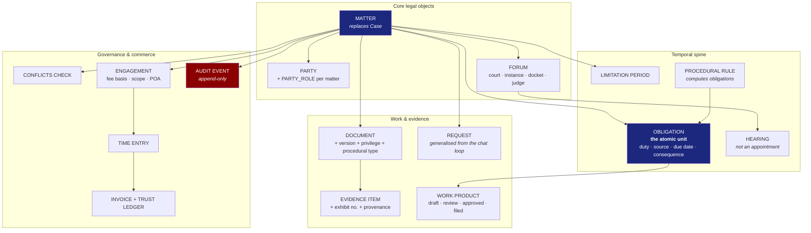

**The keystone is OBLIGATION.** CaseAce's deepest error is treating a deadline as a property of a task. In legal practice the causality runs the other way: *the law imposes an obligation; the obligation has a due date and a consequence for breach; work is created in order to discharge it.* Model the obligation as the first-class citizen and tasks, calendar entries, reminders and escalations all become projections of it. Model the task first — as CaseAce did — and the obligation can never be reconstructed.

---

# PHASE 3 — Workflow Discovery

Fourteen workflows were reconstructed from the interaction code, the authors' sequence diagrams and the API call graph. Each is presented as a BPMN-style flow with swim-laned actors, followed by a diagnostic reading. **Workflows are the most transferable asset in this report** — they encode what practitioners actually do, independent of any technology.

Notation: `[ ]` activity · `< >` gateway/decision · `( )` event · `╳` breakdown point · **bold** = system-initiated.

---

## W1 — Create Case and Assemble the Team

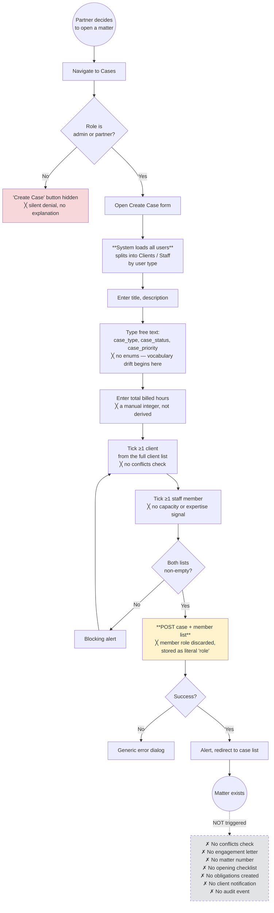

**Diagnostic.** Matter creation is *pure data entry terminating in a dead end*. In real practice, opening a matter is the highest-leverage automation moment in the entire firm lifecycle — it is when conflicts must be cleared, the engagement scope fixed, the file numbered, the limitation date calculated, the opening checklist instantiated and the client formally onboarded. CaseAce performs none of it. **This workflow is the single largest AI opportunity in the product** (Phase 6, A1).

Note also that team assignment presents an undifferentiated list of every user in the firm with no workload, expertise, availability or conflict signal. The decision that most determines matter profitability and quality is made blind.

---

## W2 — Request a Document from a Client *(the reference workflow)*

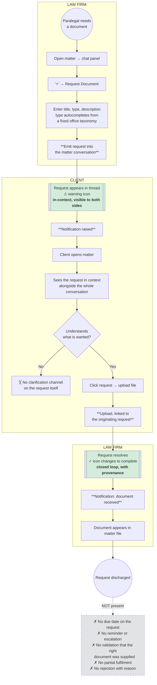

**Diagnostic — this is the product's best idea and deserves close reading.** Four properties make it good, and all four are worth preserving verbatim as *concepts*:

1. **In-context.** The request lives in the matter conversation, not in a separate portal or an email thread. The client sees it beside everything else about their case.
2. **Object, not message.** The request is a first-class thing with state, not a sentence someone wrote. It can be queried, counted and chased.
3. **Self-discharging.** Fulfilment happens *against the request*, so the uploaded document carries permanent provenance — we know why it exists.
4. **Visibly resolving.** The state change is rendered (warning → checkmark), so both parties share an accurate picture of what is outstanding without asking.

Most commercial practice-management systems do this worse: they send an email with a portal link, and the resulting upload has no link back to the ask. **Generalise this into the Rafter `REQUEST` primitive** — the same shape serves client document collection, discovery responses, insurer disclosure, expert instructions and internal work requests.

What is missing is everything that makes a request *reliable*: no due date, no chase, no escalation, no validation. Those are precisely the parts an agent should own (Phase 6, A4).

---

## W3 — Schedule an Appointment and Collect Responses

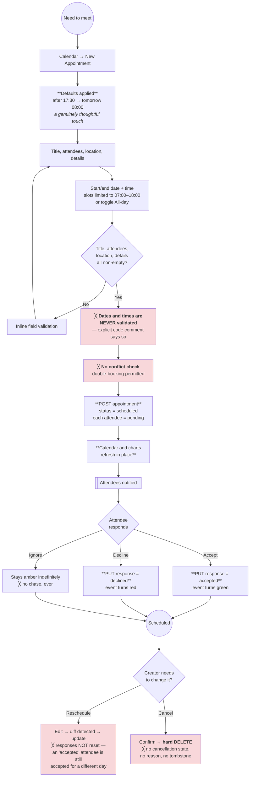

**Diagnostic.** The invitation-response half is well modelled and worth keeping. The temporal half is unsafe in three specific ways, each of which is a real professional-liability vector in a litigation practice:

- **No date validation, by explicit decision.** A code comment states that start and end dates and times "don't need to check validity."
- **No conflict detection anywhere.** Two hearings at the same hour for the same advocate is a permitted state.
- **Rescheduling preserves stale acceptances.** Moving an appointment does not reset attendee responses, so the system will confidently report that everyone has accepted a meeting time they never saw.

Combined with the timezone handling (the calendar is declared to run in UTC while being fed local wall-clock strings), **the calendar is the least trustworthy subsystem in the product** — and the calendar is where court dates would live.

---

## W4 — Task Assignment and Progression

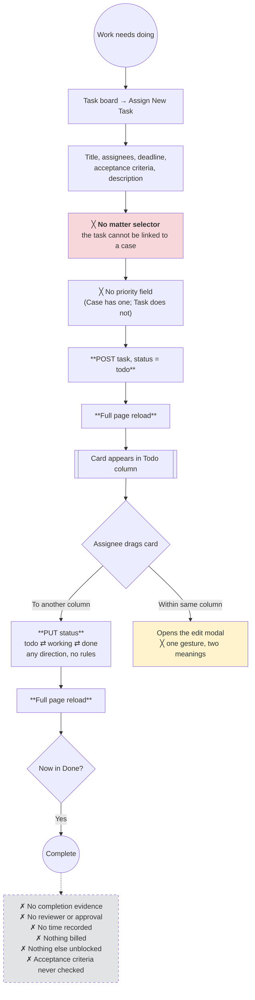

**Diagnostic.** A generic three-column Kanban with no legal semantics. Three findings carry forward.

*The orphan defect appears here in its purest form.* A task has a deadline and no matter. The firm therefore cannot answer "what is outstanding on the Cohen file?" — the question a partner asks twenty times a day.

*The gesture collision is a real UX finding.* Dragging a card to a new column changes its status; dragging it and dropping it back opens the editor. The same physical action means two different things depending on where the user releases — a classic mode error that will produce accidental edits.

*Completion is a dead end.* Marking a task done triggers nothing: no time entry, no billing, no unblocking of dependent work, no evidence capture, no check against the acceptance criteria the form insisted on collecting. **The acceptance-criteria field is the right idea stranded without the review step that would give it meaning** — and it is exactly the contract an AI agent would need in order to self-verify.

---

## W5 — Onboarding and Access *(the security workflow)*

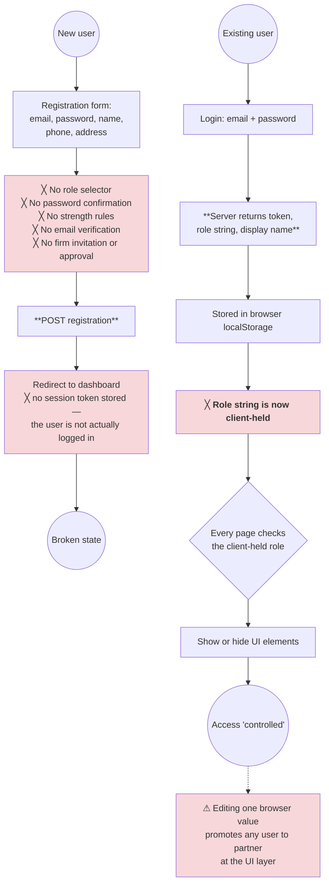

**Diagnostic.** Self-registration with no role assignment, no verification and no firm approval is not an onboarding workflow — it is an open door. The correct legal-sector model is **invitation-only provisioning**: the firm creates the identity, assigns the role and the matter access, and the user activates it. Client access should be *matter-scoped and time-bounded*, granted when a matter opens and revoked when it closes.

The deeper finding is architectural: the role is a client-held value. Two subsystems (document editability, appointment administration) correctly ask the server instead. **That minority pattern is the one to generalise.**

---

## W6 — Notification Consumption

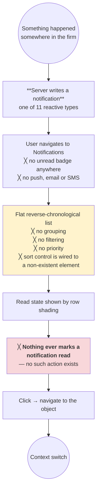

**Diagnostic.** All eleven notification types are **retrospective**: something was added, edited, deleted, assigned, accepted, declined. **Not one is prospective.** For a product sold on deadline safety, the alerting subsystem contains no alerts — only echoes. A user could read every notification and still miss every deadline.

This is not a missing feature; it is an inverted mental model. The system notifies about *system events* when a practitioner needs to be warned about *legal consequences*. See Phase 7 for the replacement.

---

## W7–W14 — Remaining workflows in brief

| # | Workflow | Shape | Principal defect |
| --- | --- | --- | --- |
| **W7** | **Upload document to matter** | Choose matter → title, free-text type, description → select file → upload → reload | Only the first file is taken despite a multi-select control; no virus scan; no OCR; no classification; no version check; failures are silently swallowed |
| **W8** | **View / preview document** | Open document → metadata → click to preview | Preview is delegated to a **public third-party document viewer** using a raw storage identifier — confidential material is rendered outside the application's own authentication boundary. For privileged legal documents this is the most serious single defect in the system |
| **W9** | **Edit case** | Load case → load all users → pre-tick members → edit → update | Full-record overwrite with no optimistic locking: two partners editing concurrently silently lose one set of changes. No change history |
| **W10** | **Delete case** | Confirm → hard delete → redirect | Irreversible destruction of a legal matter, its documents and its conversation, behind one confirmation. No retention check, no archive, no tombstone |
| **W11** | **Edit own profile** | Two competing surfaces — a modal and a full page — both hitting the same endpoints | Duplicate, divergent implementations of the same function; the password value round-trips to the browser in clear text |
| **W12** | **Change password** | Old + new → update → forced re-login | The page exists and works but **is not linked from anywhere in the navigation** — a complete, unreachable feature |
| **W13** | **View firm dashboard** | Partner lands → one statistics call → five charts | Two of five charts render hardcoded fabricated data; every metric tile on four screens is a static number. **A management dashboard that cannot be trusted is worse than none** |
| **W14** | **In-matter chat** | Join matter room → exchange messages in real time | The only genuine real-time surface in the product. No history pagination, no attachments on plain messages, no read receipts, no participant list, no export — and chat content is not part of the matter record for retention or disclosure purposes |

---

## 3.1 The workflows that do not exist

Cataloguing absent workflows is more valuable than cataloguing present ones, because each absence is a requirement the market has already validated.

| Absent workflow | Why it matters | Rafter priority |
| --- | --- | --- |
| **Track a deadline** | The product's stated purpose. No deadline entity, no rule engine, no escalation | **P0** |
| **Schedule and prepare for a hearing** | The motivating use case. No hearing entity, no court, no preparation chain | **P0** |
| **Run a conflicts check** | An ethical precondition to opening any matter. Entirely absent | **P0** |
| **Close a matter** | Cases have no lifecycle. Closure, disposition, archival and retention are unrepresentable | **P0** |
| **Record time** | No time entry exists; the hours field is typed by hand | **P1** |
| **Generate an invoice** | No rate, no invoice, no trust ledger. The firm cannot be paid | **P1** |
| **Produce a document** | The system stores documents and cannot create one. **The core daily labour of a law firm is entirely outside the product** | **P0** |
| **Onboard a client** | No intake, no KYC/AML, no engagement letter, no power of attorney | **P1** |
| **Calendar a limitation period** | No limitation concept anywhere. This is the highest-consequence date in litigation | **P0** |
| **Escalate an overdue item** | Nothing escalates. Nothing chases. Nothing warns | **P0** |
| **Report to a client** | No status report, no matter summary, no client-facing update | **P1** |
| **Hand over a matter** | No reassignment workflow, no handover brief, no continuity if a fee-earner leaves | **P2** |
| **Audit what happened** | No activity log, no version history, no who-changed-what | **P0** |

Note the pattern: **the absent workflows are the ones with legal consequence; the present workflows are the ones with only administrative consequence.** CaseAce automated the parts of a law firm that are not specifically legal — which is precisely why it reads as a project-management tool wearing a wig.

## 3.2 The meta-pattern: every workflow terminates

The structural signature shared by all fourteen workflows:

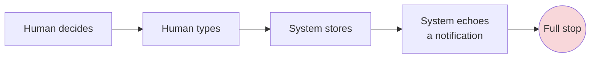

**No workflow in CaseAce triggers another workflow.** Creating a matter produces no checklist. Uploading a document produces no obligation. Completing a task unblocks nothing. Scheduling a hearing generates no preparation chain. Every process is a straight line from human intent to database row, with a notification as its terminal echo.

This is the deepest architectural difference between CaseAce and what Rafter OS must be. The target shape:

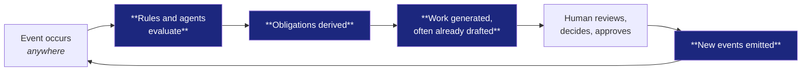

CaseAce is **request/response**. Rafter OS must be a **closed loop**: event-driven, obligation-deriving, work-generating, human-supervised, and self-perpetuating. That single reorientation is the substance of Phase 7.

---

# PHASE 4 — Screen Inventory

Nineteen distinct surfaces were catalogued. Each is assessed as a product artifact: what job it does, for whom, what it gets right, where it fails, and what an AI-native successor would put there instead.

## 4.1 Inventory at a glance

| # | Screen | Primary user | Category | State |
| --- | --- | --- | --- | --- |
| S1 | Dashboard | Partner / Admin | Analytics | Partly fabricated |
| S2 | Case List | All staff | Register | Functional |
| S3 | Case Detail | All | **Workspace** | Functional — the product's centre |
| S4 | Create Case | Partner / Admin | Form | Functional |
| S5 | Edit Case | Partner / Admin / Associate | Form | Functional |
| S6 | Document List | All | Register | Functional |
| S7 | Document Detail | All | Viewer | Functional, insecure preview |
| S8 | Task Board | Staff | **Kanban** | Functional; analytics broken |
| S9 | Appointment Calendar | All | Calendar | Functional; timezone-unsafe |
| S10 | Client List | Partner / Admin | Register | Functional; mock columns |
| S11 | Client Detail | Partner / Admin | Record | Functional; ungated actions |
| S12 | Employee List | Partner / Admin | Register | Clone of S10 |
| S13 | Employee Detail | Partner / Admin | Record | Clone of S11 |
| S14 | Notifications | All | Feed | Functional; no read action |
| S15 | Profile (page) | All | Settings | Duplicate of S16 |
| S16 | Profile (modal) | All | Settings | Duplicate of S15 |
| S17 | Change Password | All | Form | **Unreachable** |
| S18 | Login | Anonymous | Auth | Functional |
| S19 | Register | Anonymous | Auth | Broken (no session) |

Plus three non-screens: a root redirector, a developer template scaffold left in the tree, and an orphaned duplicate component.

**Composition analysis.** Six of nineteen screens are registers (sortable tables of records). Four are forms. Two are duplicates of other screens. One is unreachable. **Only one screen — Case Detail — is a workspace where actual legal work happens.** The product is 90% filing cabinet, 10% desk. An AI-native successor should invert that ratio.

---

## 4.2 Screen-by-screen analysis

### S1 — Dashboard

**Job:** give a partner firm-wide operational awareness at a glance.
**User:** partners and admins only; everyone else is redirected away.

**Contents:** five chart cards — case status donut (open/closed/pending), user-population donut across the five roles, a client-satisfaction radar over five dimensions, a "user activities by day" line chart, and a "documents analytics" bar chart. Plus a time-of-day greeting.

| Strengths | Weaknesses |
| --- | --- |
| Correctly identifies that partners need a distinct surface | **Two of five charts render hardcoded fake data** — the "documents" chart plots categories A–G |
| Time-of-day greeting is a small, human touch | The satisfaction radar has no collection instrument anywhere in the product |
| Single aggregated statistics call — efficient | Every metric is a **count, not a signal**: nothing indicates whether anything is *wrong* |
| Clean 9/3 column composition | No date range, no drill-down, no comparison to prior period, no targets |

**Missing capabilities.** Nothing about risk, deadlines, capacity, revenue or client health. A partner cannot learn from this screen: what is at risk this week, who is overloaded, which matters are stalling, what will be billed this month, which clients are unhappy, or whether any obligation is about to be missed. **It reports the shape of the database, not the state of the business.**

**AI opportunity.** Replace the entire screen with a **generated morning brief**: a written narrative of what changed overnight, what is at risk, what needs a decision today, and what the system has already handled — with the underlying charts available on demand rather than presented by default. The correct primary artifact for a busy partner is prose with citations, not a wall of donuts.

---

### S2 — Case List

**Job:** the matter register.
**Contents:** admin-only statistics block, then a sortable five-column table — Case Title, Case Type, Case Status, Priority, Total Billed Hour. Empty state present and well handled.

| Strengths | Weaknesses |
| --- | --- |
| Genuine empty state with illustration and copy | Five columns cannot support triage: no client, no responsible lawyer, no next deadline, no last activity |
| Sortable columns | **No search, no filter, no saved views, no pagination** — unusable past ~50 matters |
| Role-gated create action | Status and priority are free text, so sorting groups nothing reliably |
| | The statistics tiles above the table are hardcoded constants |

**The prototype was better than the build.** The authors' own high-fidelity mockup shows a richer table — Name, Client, Type, Status, Staff Assigned (as avatars), Priority, Total Billed Hours, **Upcoming Activities** — plus a card/grid view alternative showing the next event per matter with a date chip. **"Upcoming Activities" is the single most useful column a matter register can have, it was designed, and it did not survive implementation** — because the underlying relationship (matter → dated obligations) was never built. The UX regression and the data-model defect are the same defect.

**AI opportunity.** A register that is **ranked by risk rather than sorted by column**, with a one-line generated status for each matter ("awaiting client documents 9 days; response due in 6"), natural-language filtering, and anomaly flagging for matters that have gone quiet.

---

### S3 — Case Detail *(the product's centre of gravity)*

**Job:** the single workspace for a matter.
**Contents:** case metadata; client roster (avatars); staff roster (avatars); the matter's document table with an upload action; and a **real-time chat panel with the embedded document-request mechanism**. Edit and delete actions are role-gated.

| Strengths | Weaknesses |
| --- | --- |
| **Correctly conceived as a workspace, not a record view** | **No tasks and no appointments appear** — because neither is linked to a case. The matter workspace cannot show the matter's work |
| The chat + document-request panel is genuinely innovative | Client and staff rosters are **hardcoded to display three people each** with no overflow affordance |
| Documents are shown in matter context | No timeline, no activity history, no next-step indicator |
| Real-time collaboration in-context | No parties beyond our own side; no court; no deadlines; no financials |
| | Every roster member is fetched with a separate request — the page degrades with team size |

**This screen is simultaneously the best and the most damaged surface in the product.** The concept is right: one place, matter-scoped, with conversation and evidence collection woven together. The execution is hollowed out by the orphaned-deadline defect — the workspace cannot display the work.

**AI opportunity.** The natural home for a **matter copilot**: a conversational surface with full matter context that answers questions over the file, drafts correspondence and filings, surfaces contradictions across documents, proposes next steps with authority, and executes routine actions under supervision. The chat panel already exists as an affordance — it is currently wired to other humans. Wiring it additionally to an agent with matter context is the highest-leverage single change conceivable to this product.

---

### S4 / S5 — Create and Edit Case

**Job:** matter intake and amendment.
**Contents:** six fields plus two full-population checkbox tables for selecting clients and staff.

| Strengths | Weaknesses |
| --- | --- |
| Explicit separation of client and staff assignment | **Free-text type, status and priority** — the origin of all downstream vocabulary drift |
| Enforces at least one client and one staff member | The per-member role column is collected in the UI and discarded on save |
| Client-side validation with inline feedback | Selection tables load every user in the firm with no search — unusable at scale |
| | No conflicts check, no matter number, no engagement, no dates, no court, no opposing party |
| | Edit performs a full overwrite with no locking or history |

**AI opportunity.** Replace the form with **document-driven intake**: the user uploads the engagement letter, the claim, or the first correspondence, and the system proposes the entire matter record — parties, forum, cause of action, claim value, procedural posture, limitation date and the opening checklist — for human confirmation. Typing a matter into a form is work that should not exist by 2026.

---

### S6 / S7 — Document List and Detail

**Job:** the firm-wide document register and the single-document view.

| Strengths | Weaknesses |
| --- | --- |
| Sensible columns including *Case Involved* and *Last Accessed* | **Preview is delegated to a public third-party viewer** using a raw storage identifier — confidential and privileged material rendered outside the app's authentication boundary. The gravest defect in the system |
| **Server-issued per-record edit permission** — the correct authorization pattern, used here and almost nowhere else | No full-text search, no content search, no OCR |
| An access log exists on the record | Only the most recent access is ever displayed |
| An access-control list exists on the record | No versioning, no privilege marking, no execution status, no retention class |
| | Document type is free text over a generic office taxonomy |

**AI opportunity.** Automatic classification into a *procedural* taxonomy; obligation extraction from content (an order with a response period should create the deadline itself); privilege detection; cross-document contradiction analysis; semantic search over the whole corpus; and automatic bundle and exhibit assembly. The access log that already exists is the seed of a genuine audit capability.

---

### S8 — Task Board

**Job:** personal and team work management.
**Contents:** three-column drag-and-drop Kanban (Todo / Working / Done), two analytics charts, and a task creation modal.

| Strengths | Weaknesses |
| --- | --- |
| Direct-manipulation Kanban is the right interaction for work triage | **Tasks cannot be linked to matters** — the defining defect |
| Acceptance criteria is an unusually thoughtful field | **The analytics charts filter on a status tasks can never hold and therefore always report zero** |
| | No priority, no swimlanes, no grouping, no filter, no personal-versus-team view |
| | Same-column drop opens the editor — one gesture, two meanings |
| | Every change triggers a full page reload |

**AI opportunity.** Tasks should be *generated* from matter stage and obligations rather than typed. The board should be **ordered by consequence** — what happens if this is late — rather than by column position. And most tasks should arrive with a draft already attempted, converting the human's job from *doing* to *reviewing*.

---

### S9 — Appointment Calendar

**Job:** scheduling and attendance coordination.
**Contents:** a week time-grid and a month list view, colour-coded by role and response state, with a create/edit/respond modal and admin-only analytics.

| Strengths | Weaknesses |
| --- | --- |
| **Colour encodes response state**, not just event existence — genuinely good information design | Only two views; no day and no month-grid |
| Per-attendee accept/decline properly modelled | **No conflict detection** — double-booking is permitted |
| Sensible after-hours defaulting (post-17:30 → next morning) | **No case linkage** |
| Past events correctly lock responses | **Timezone handling is unsound** — UTC declared, local wall-clock supplied |
| | Rescheduling does not reset acceptances |
| | No recurrence; no drag-to-reschedule; no external calendar sync |

**AI opportunity.** A **court-aware calendar**: hearing dates entered once generate their own preparation chain backwards from the date; travel and preparation blocks are sized automatically; conflicts and clashes are detected against the whole firm; and listing notices arriving by email are converted into calendar entries without human transcription.

---

### S10–S13 — Client and Employee Registers and Records

**Job:** the people directory.

These four screens are **two screens implemented twice**. The employee pages are a clone of the client pages — still calling the client endpoint for deletion, still captioned "Client Details".

| Strengths | Weaknesses |
| --- | --- |
| Consistent, learnable record layout | The most damaged area of the product |
| Inline edit/save/cancel pattern is clean and reusable | *Last Communication Date* and *Next Follow-up Date* columns render a literal placeholder string on every row |
| | Every metric tile is a hardcoded constant |
| | Delete and edit actions on the detail pages are **not role-gated at all** |
| | No client differs structurally from an employee; no legal-entity concept; no relationship history |

**The two placeholder columns are the most valuable thing on these screens** — they are an unimplemented requirement stated in the interface. Client relationship management genuinely does need last-contact and next-follow-up tracking. The team knew; the entity did not exist.

**AI opportunity.** Client health scoring from real communication data; automatic last-contact derivation from actual activity rather than manual entry; follow-up suggestion by relationship pattern; and per-client communication-style adaptation.

---

### S14 — Notifications

Analysed in Phase 3 (W6). A flat, reverse-chronological, unfilterable list of eleven retrospective event types, with a read state that nothing can set and a sort control wired to a non-existent element. **No warnings, no priority, no aggregation, no channels.**

**AI opportunity.** Replace entirely with an attention engine (Phase 7, R4).

---

### S15–S17 — Settings, Profile and Password

Two competing profile editors — a page and a modal — implement the same function against the same endpoints, and the password value is round-tripped to the browser in clear text. The change-password page is complete, functional, and **linked from nowhere**.

No configurability exists beyond personal contact details: no notification preferences, no language, no timezone, no signature block, no delegation or out-of-office, no firm settings, no templates, no roles administration, no integrations.

**Finding worth generalising:** *duplicate implementations of the same function are a governance failure, not a code-quality failure.* Two profile editors mean two places for a security control to be missed — and indeed only one of them was ever considered for the password-handling problem.

---

### S18 / S19 — Login and Register

Login works. Registration does not complete a session, so a newly registered user lands on an authenticated page without authentication. There is no email verification, no password confirmation, no strength rules, no forgotten-password flow, no multi-factor authentication and no single sign-on.

**For a system holding privileged legal material, the absence of MFA and of any account-recovery path is disqualifying on its own.**

---

# PHASE 5 — UX Review

*Reviewed as a modernisation engagement. Visual design and colour are explicitly out of scope; the assessment is of information architecture, decision support and cognitive economics.*

## 5.1 Information hierarchy

**Verdict: inverted.** The product consistently gives the most screen space to the least decision-relevant content.

The clearest instance is the register screens. Case List, Document List, Client List and Employee List each devote the top third of the viewport to a block of large-format metric tiles — *Total Cases 36*, *High-Priority 19*, *Archived 12*, *Resolution Time 2.4 weeks* — before the actual working content begins. These numbers are hardcoded, but the deeper problem is that **they would be low-value even if they were real**. A practitioner opening the case list has a task in mind: find a matter, or discover what needs attention. Neither is served by a firm-wide count. The tiles push the working content below the fold and answer a question nobody asked.

A second instance is the case detail page, where descriptive metadata (title, type, status, priority, hours) occupies the primary position, while the two genuinely dynamic elements — documents and the live conversation — sit below. **Static attributes rank above changing state**, which is backwards: the reason to open a matter is almost always to find out what has changed.

**Principle for the successor:** rank by *decision value*, not by *data availability*. The top of every screen should answer "what requires me?" — not "how many are there?"

## 5.2 Workflow efficiency

**Verdict: acceptable at demonstration scale, structurally unable to scale.**

Three specific inefficiencies compound as a firm grows:

**Selection does not scale.** Assigning people to a matter presents an unfiltered checkbox table of every user in the firm. At 45 users this is tedious; at 200 it is unusable. No search, no recent, no suggestion, no grouping.

**Registers cannot be narrowed.** No screen offers search or filtering. Sorting is the only affordance. Finding one matter among 400 means sorting by title and scrolling — and there is no pagination, so every record renders at once.

**Mutations reload the world.** Creating or moving a task discards the entire page and rebuilds it. Interestingly, the appointment module updates in place from the server response — so the better pattern existed in the codebase and was not adopted by the module forked from it.

Against this, one genuine efficiency deserves credit: **the after-hours scheduling default**. Opening the appointment form after 17:30 pre-fills tomorrow at 08:00. Someone observed real behaviour and encoded it. That is good product work and worth preserving as a design value: *defaults should encode the common case, and the common case should be learned from observation.*

## 5.3 Cognitive load

**Verdict: high, and misallocated — the system offloads its uncertainty onto the user.**

The dominant cognitive burden is **vocabulary invention**. Every time a matter is created, the user must invent a type, a status and a priority as free text. Nothing suggests, constrains or remembers prior choices. The consequence is not merely inconsistent data; it is that **every user must independently hold the firm's classification scheme in their head**, and no two will hold the same one. A controlled vocabulary is not a data-entry convenience — it is a *memory offload*.

Four further loads:

- **No context carries between screens.** Moving from a matter to the task board loses the matter entirely; the user must re-establish context mentally on every navigation.
- **Silent denial.** Unauthorised actions are hidden rather than disabled-with-reason. A paralegal wondering why they cannot create a matter has nothing to read.
- **Undifferentiated feeds.** The notification list ranks a document rename equally with a cancelled appointment. Triage is entirely manual.
- **Gesture ambiguity.** Same-column drag opens an editor; cross-column drag changes status. The user must remember which release point means what.

**The deepest load is unquantified risk.** Nowhere does the system tell a practitioner *what is most likely to hurt them*. That assessment — the one that keeps lawyers awake — is performed entirely in the user's head, unaided, every day. **Removing that load is the core value proposition of an AI-native successor.**

## 5.4 Navigation

**Verdict: the strongest dimension of the product.**

The role-filtered, strictly nested three-tier navigation is clean, learnable and correct in structure. Persistent vertical navigation with active-state indication, and a reduction that is a proper subset at each tier, is a pattern worth carrying forward verbatim as a concept.

Its limits are worth naming precisely, because they are the limits of *entity-oriented* navigation in general:

- **The information architecture is entity-oriented, not matter-oriented.** Top-level items are Cases, Documents, Tasks, Appointments, Clients — the shape of the database. But practitioners think in matters: *the Cohen file* is one thing containing documents, deadlines, people and correspondence. Working on one matter requires visiting five sections and mentally re-joining them. **The navigation reifies the orphaned-deadline defect as a user experience.**
- No breadcrumbs, no back affordance, no global search, no recents, no favourites, no cross-entity jumping, no command palette, no keyboard access.
- One complete feature (change password) is unreachable from anywhere.

**Principle for the successor:** primary navigation should be **matter-first**, with entity views available as secondary lenses. The question "what is happening on this file?" must be answerable without navigation.

## 5.5 Decision support

**Verdict: absent. This is the central UX failure.**

The product presents data and never interprets it. Across nineteen screens, there is no instance of the system telling a user *what to do*, *what is wrong*, *what is urgent*, or *what happens if they do nothing*.

Concretely, the system displays a case priority — typed by a human, weeks ago, as free text, never revisited. It does not compute urgency. It displays a deadline on a task card with no visual distinction between one due in an hour and one due next quarter. It displays "Total Billed Hour" without a budget to compare against. It displays a satisfaction score with no trend and no threshold. **Every number is presented naked, without the comparison that would make it meaningful.**

The five decisions a practitioner actually makes daily, and the support provided for each:

| Decision | Support provided |
| --- | --- |
| What must I do first today? | None |
| Is any matter at risk? | None |
| Who should handle this new matter? | None — an unfiltered name list |
| Is this matter profitable? | None — hours with no rate |
| Should I escalate this to a partner? | None |

**Every one of these is an AI-shaped hole.** Decision support is the entire delta between CaseAce and Rafter OS, and Phase 6 is organised around filling it.

## 5.6 Missing dashboards

The one dashboard that exists serves partners and reports counts. Six dashboards that a firm genuinely needs do not exist:

| Dashboard | Audience | Core question |
| --- | --- | --- |
| **Deadline and risk board** | Everyone | *What is due, what is at risk, what is already breached?* — the single most important missing surface |
| **My day** | Fee-earners | *What requires me, in what order, and what has the system already done?* |
| **Matter health** | Responsible lawyer | *Is this file progressing, stalling, or bleeding?* |
| **Capacity and workload** | Partners | *Who is overloaded, who is idle, who is on the critical path?* |
| **Financial** | Partners | *WIP, realisation, billing, collection, write-offs* |
| **Client health** | Relationship owners | *Responsiveness, sentiment, unresolved requests, time since last contact* |

Note that four of the six are impossible on the current model, not merely unbuilt: without matter-linked deadlines, without rates, without a matter lifecycle and without contact history, the data does not exist to populate them.

## 5.7 Missing contextual information

The most consequential UX gaps are not screens but *context* — the small, adjacent facts that make a number actionable:

- **On a deadline:** its legal source, the consequence of breach, whether it is extendable, who is responsible, and whether the work is under way.
- **On a matter:** what happened last, what happens next, what is outstanding from whom, and how long it has been quiet.
- **On a person:** their current load, their availability, their expertise, and their history on similar matters.
- **On a document:** whether it is current, whether it is privileged, whether it has been served or filed, and what obligations it creates.
- **On any number:** the trend, the target, the peer comparison, and the threshold at which it becomes a problem.
- **Everywhere:** *why am I seeing this, and what should I do about it?*

## 5.8 Summary scorecard

| Dimension | Grade | One-line assessment |
| --- | --- | --- |
| Navigation structure | **B** | Clean, nested, role-aware — but entity-oriented where it should be matter-oriented |
| Visual consistency | **B−** | Coherent system, undermined by duplicated and divergent screens |
| Information hierarchy | **D** | Vanity metrics above the fold; static attributes above changing state |
| Workflow efficiency | **C−** | Adequate at demo scale; no search, filter, or pagination anywhere |
| Cognitive load | **D** | Vocabulary invention, lost context, silent denial, unquantified risk |
| **Decision support** | **F** | Categorically absent — no urgency, no interpretation, no recommendation |
| Error prevention | **D−** | No conflict detection, no date validation, no locking, deletion as lifecycle |
| Trust and data honesty | **F** | Fabricated dashboard data and placeholder table values shipped as real |
| Contextual richness | **D** | Numbers presented without the comparisons that give them meaning |
| Accessibility | **D** | No keyboard paths, no landmarks, colour-only state encoding on the calendar |

**Composite: D+.** A navigationally sound, visually coherent, structurally hollow product. The interface is a competent window onto a database that does not contain the things a lawyer needs to see.

---

# PHASE 6 — AI Opportunity Map

## 6.1 The allocation principle

Before mapping opportunities, the allocation rule. Legal work divides on two axes: **consequence of error** and **determinacy of method**.

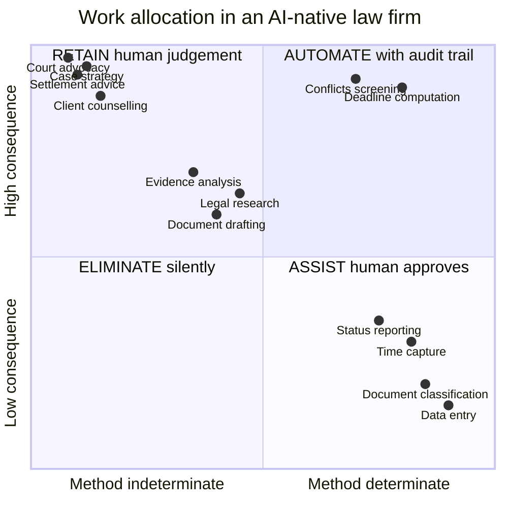

*Quadrant reading: upper-right = high consequence, determinate method → automate with a full audit trail. Upper-left = high consequence, indeterminate method → retain for human judgement. Lower-right = low consequence, determinate → eliminate the work entirely. Lower-left → assist, with human approval.*

**The governing rule for legal AI:** determinacy decides *whether* to automate; consequence decides *how much supervision* the automation carries. High-consequence determinate work (deadline computation, conflicts screening) should absolutely be automated — but with a complete audit trail, a stated authority for every output, and a named human accountable. Low-consequence indeterminate work is where drafting assistance lives. **Nothing high-consequence and indeterminate should ever be automated**, and no amount of model capability changes that, because the constraint is professional accountability, not capability.

## 6.2 Opportunity map by workflow

Each opportunity is rated **V** (value 1–5) and **F** (feasibility 1–5).

---

### A1 — Matter intake and opening `V5 F4` — *highest-value opportunity in the product*

| | |
| --- | --- |
| **Eliminate** | Manual entry of parties, forum, docket, claim value, dates. Manual matter numbering. Manual checklist construction. Manual calendar entry of known procedural dates. |
| **Assist** | Cause-of-action classification; complexity and track assessment; fee-arrangement recommendation from comparable historical matters; draft engagement letter and power of attorney. |
| **Retain** | The decision to accept the matter. Conflict waiver judgement. Fee agreement. Assessment of client credibility. |

**Mechanism.** Documents in → matter record out. The user uploads the claim, the engagement correspondence or the first filing; the system proposes the complete matter: parties with their per-matter roles, court and instance, docket number, cause of action, claim amount, procedural posture, limitation date, the obligation set implied by the current stage, and the opening checklist. The human confirms or corrects. **Correction is the training signal.**

**Agents:** `IntakeAgent` (extract and propose) · `ConflictsAgent` (screen all parties semantically against the historical corpus) · `EngagementAgent` (draft the retainer and POA).

**Why it ranks first:** it is the moment of maximum data entry, maximum downstream consequence, and maximum determinacy. Everything else in the matter inherits from what is established here.

---

### A2 — Obligation and deadline management `V5 F3` — *the product's unfulfilled promise*

| | |
| --- | --- |
| **Eliminate** | Manual deadline calculation. Manual diarising. Manual reminder setting. Manual escalation chasing. |
| **Assist** | Deadline derivation from procedural rules; extension-application drafting; consequence-of-breach explanation; preparation-chain scheduling backwards from a fixed date. |
| **Retain** | The decision to seek an extension. Strategic sequencing. Acceptance of a calculated risk. Final verification of any date with limitation consequences. |

**Mechanism.** A rules engine that, given jurisdiction, procedural stage and a trigger event, *derives* the obligation set — each obligation carrying its due date, its legal source, its consequence of breach, and its responsible person. Court orders and listing notices arriving as documents create obligations automatically on ingestion.

**Agents:** `DeadlineAgent` (derive from rules + trigger) · `WatchdogAgent` (continuous risk monitoring and escalation) · `ExtensionAgent` (draft applications when slippage is detected).

**Critical governance constraint.** Limitation and prescription dates must be **computed, displayed with their authority, and independently human-verified** — never silently accepted. A wrong limitation date is a malpractice event. Design for a computation the human *checks*, not a computation the human *trusts*. The audit trail must record who verified, when, and against what authority.

---

### A3 — Document intelligence `V5 F5` — *highest feasibility, immediate return*

| | |
| --- | --- |
| **Eliminate** | Manual classification. Manual metadata entry. Manual date extraction. Manual filing. Manual exhibit numbering. Manual bundle assembly. |
| **Assist** | Summarisation; obligation extraction; privilege flagging; contradiction detection across the file; completeness auditing against an expected-document model; multilingual handling. |
| **Retain** | Final privilege determination. Decisions about disclosure and redaction. Evidentiary weight. Admissibility. |

**Mechanism.** Every document, on arrival, is classified into a *procedural* taxonomy (pleading, order, affidavit, exhibit, correspondence, expert report, filing receipt), has its entities and dates extracted, is checked for privilege indicators, and is compared against the rest of the file for contradictions. **An order specifying a response period creates the obligation itself.**

**Agents:** `ClassifierAgent` · `ExtractionAgent` · `PrivilegeAgent` · `ContradictionAgent` · `BundleAgent`.

**Why feasibility is highest:** classification and extraction are mature, verifiable capabilities with clear ground truth, and every output is human-visible before it has consequence.

---

### A4 — Evidence and document collection `V4 F5` — *generalising the product's best idea*

| | |
| --- | --- |
| **Eliminate** | Composing request lists. Writing chase messages. Tracking who owes what. Manually checking whether the right thing arrived. |
| **Assist** | Deriving the required-document set for a matter type; drafting the client-facing explanation of *why* each item is needed; validating uploads against the request; escalating non-response. |
| **Retain** | Deciding what is legally necessary versus merely useful. Judging sufficiency of what was produced. Deciding when to compel. |

**Mechanism.** Take CaseAce's request loop and add the four things it lacks: a due date, an automatic chase, arrival validation, and a completeness model. The system knows a matter of this type requires fourteen documents, has eleven, and generates the chase for the remaining three — in the client's language, at an appropriate cadence, escalating on silence.

**Agents:** `CollectionAgent` (plan and chase) · `ValidationAgent` (verify arrivals match requests).

---

### A5 — Legal work product generation `V5 F3` — *the largest absent capability*

CaseAce **stores** documents and cannot **produce** one. Yet drafting is the majority of legal labour.

| | |
| --- | --- |
| **Eliminate** | Boilerplate assembly. Formatting to court standards. Caption and party-block construction. Citation formatting. Cross-reference and exhibit numbering. Table-of-authorities construction. |
| **Assist** | First drafts of pleadings, motions, responses, affidavits, letters and advice; argument structuring; authority selection; adversarial review of our own draft. |
| **Retain** | **Every legal position asserted. Every representation to a court. Signature. Filing. Strategy.** |

**Mechanism.** Templates bound to matter data, filled from the matter record, drafted by a model with full file context, formatted to the firm's house standard, and delivered as an editable draft that a lawyer owns. **The output is always a draft attributed to a human who must adopt it.**

**Agents:** `DraftingAgent` · `CitationAgent` (verify every authority actually exists and says what is claimed — non-negotiable) · `RedTeamAgent` (attack our draft as opposing counsel would) · `FormatAgent` (house style and court-compliant rendering).

**Hard governance rule.** No generated citation may reach a court unverified. Citation hallucination is the single highest-frequency, highest-consequence AI failure mode in legal practice, and it has already produced sanctions in multiple jurisdictions. Verification must be **mechanical, mandatory and logged** — not a prompt instruction.

---

### A6 — Matter intelligence and copilot `V5 F4`

| | |
| --- | --- |
| **Eliminate** | Re-reading a file to recall its state. Manual chronology construction. Manual contradiction hunting. Manual status summarisation. |
| **Assist** | Question answering over the matter with citations; timeline generation; witness and party mapping; risk assessment; next-step recommendation with authority. |
| **Retain** | Strategy. Advice to the client. Settlement judgement. Assessment of witness credibility. |

**Mechanism.** The matter workspace gains a conversational surface with full file context — grounded strictly in the matter's own documents, citing every claim to a source, and refusing to answer beyond the record. This is the natural evolution of the chat panel that already exists.

**Agents:** `MatterCopilot` · `ChronologyAgent` · `RiskAgent`.

---

### A7 — Time capture and billing `V4 F4`

| | |
| --- | --- |
| **Eliminate** | **Manual timesheet entry** — the most disliked task in professional services. Narrative writing. Manual invoice assembly. |
| **Assist** | Activity inference from system events; narrative drafting from actual work performed; write-off recommendation; budget-variance alerting. |
| **Retain** | Approval of every entry before billing. Write-off decisions. Fee negotiation. Client-facing billing conversations. |

**Mechanism.** Time is **observed, not typed**. Documents drafted, calls logged, emails sent, hearings attended and research performed all emit events with duration; the system proposes daily entries with narratives; the fee-earner approves or adjusts in one pass. **Approval is mandatory — inferred time may never bill unreviewed.**

---

### A8 — Practice operations `V3 F4`

Assignment recommendations from real capacity and expertise; matter-health monitoring with stall detection; client-responsiveness tracking; profitability analysis by matter type; and the **generated partner brief** that replaces the dashboard. Retained: hiring, pricing, client acceptance, personnel decisions.

---

## 6.3 Agent architecture

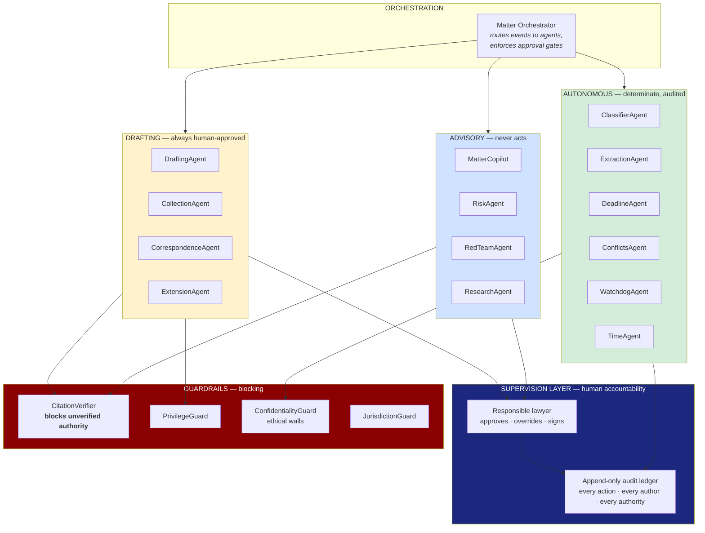

**Three tiers, three supervision regimes.** Autonomous agents act on determinate work and log everything. Drafting agents produce artifacts that require a named human to adopt them. Advisory agents never act at all — they inform. Guardrails are **blocking**, not advisory: an unverified citation does not produce a warning, it prevents the document from leaving the system.

## 6.4 Tool surface (MCP)

The capability set an agent needs, expressed as tools rather than screens. This is the durable interface of a legal OS — **screens are one client of it; agents are another.**

| Domain | Tools |
| --- | --- |
| **Matter** | `matter.open` · `matter.get` · `matter.search` · `matter.timeline` · `matter.close` · `matter.health` |
| **Party** | `party.add` · `party.resolve` *(entity resolution across matters)* · `party.conflicts_check` |
| **Obligation** | `obligation.derive` *(rules → dates)* · `obligation.create` · `obligation.list_at_risk` · `obligation.discharge` · `obligation.verify` *(human sign-off)* |
| **Document** | `document.ingest` · `document.classify` · `document.extract` · `document.search` *(semantic, matter-scoped)* · `document.compare` · `document.bundle` · `document.privilege_check` |
| **Drafting** | `draft.create` · `draft.format` *(house style)* · `draft.cite_check` **(blocking)** · `draft.redteam` |
| **Request** | `request.create` · `request.chase` · `request.validate` · `request.status` |
| **Calendar** | `calendar.schedule` · `calendar.check_conflicts` · `calendar.derive_prep_chain` · `calendar.sync` |
| **Time & billing** | `time.observe` · `time.propose` · `time.approve` · `invoice.draft` |
| **Research** | `research.query` · `research.verify_authority` **(blocking)** · `research.citator` |
| **Governance** | `audit.log` · `audit.query` · `access.check` · `wall.enforce` |

**Design rule:** every tool is **matter-scoped and permission-checked at the server**. An agent inherits the authority of the human who invoked it and never exceeds it. This is where CaseAce's `Document Requester` capability concept (Phase 1) becomes essential — an agent that can place obligations on third parties must hold that capability explicitly and be auditable in its exercise.

## 6.5 Priority sequencing

| Wave | Capabilities | Rationale |
| --- | --- | --- |
| **Wave 1 — Foundations** | Document classification & extraction (A3) · Semantic matter search · Obligation model with manual entry | Highest feasibility, immediate daily value, and it builds the data substrate everything else needs |
| **Wave 2 — Safety** | Deadline derivation (A2) · Conflicts screening (A1 partial) · Watchdog escalation · Audit ledger | Converts the product from convenient to *trustworthy*; this is where professional risk drops |
| **Wave 3 — Leverage** | Drafting with citation verification (A5) · Matter copilot (A6) · Collection agent (A4) | The largest labour displacement, once the substrate and guardrails exist |
| **Wave 4 — Economics** | Observed time capture (A7) · Billing · Practice analytics (A8) | Requires an event stream rich enough to infer activity — a consequence of Waves 1–3 |

**Sequencing rule: never ship leverage before safety.** A drafting agent on a system without an audit ledger and citation verification is a liability-generating machine. CaseAce's failure mode was building the convenient parts and never the consequential ones; the successor must not repeat it in a more powerful form.

---

# PHASE 7 — Rebuild 2026

*Forget the implementation. Given the problem statement and 2026 capabilities, what is the system?*

## 7.1 The reframing

CaseAce answers: **"Where is everything?"**
Rafter OS must answer: **"What does this matter require of me, and what has already been done about it?"**

| | CaseAce | Rafter OS 2026 |
| --- | --- | --- |
| Central object | Case (a folder) | **Matter** (a bundle of obligations) |
| Atomic unit | Task (typed by a human) | **Obligation** (derived from law) |
| Primary interaction | Navigate → read → type | **Converse → review → approve** |
| System posture | Passive store | **Active participant** |
| Work origin | Human remembers | **System derives** |
| Truth model | Current state | **Event ledger; state is a projection** |
| Notification | Echo of the past | **Warning about the future** |
| Documents | Stored | **Read, understood, and produced** |
| Authorization | Client-held role string | **Server-side, per-record, wall-aware** |
| Human role | Operator of a database | **Supervisor of a system, accountable for its output** |

## 7.2 What remains

Seven decisions from CaseAce survive contact with 2026 and should be carried forward as concepts:

1. **The matter as organising principle.** Correct, and the foundation of everything.
2. **The client as a first-class user.** Prescient. Client-facing transparency is now table stakes, and CaseAce had it in 2023.
3. **The in-matter document request loop.** The best idea in the repository. Generalise into the universal `REQUEST` primitive.
4. **Per-participant response state.** Invitations are objects with independent lifecycles per person. Correct modelling; keep it.
5. **Role-nested navigation.** Clean and learnable. Keep the shape, change the axis from entity-first to matter-first.
6. **Server-issued per-record permissions.** Used twice; generalise to everything.
7. **Acceptance criteria on delegated work.** Unusual, valuable, and — in an agent world — *essential*: it is the contract against which an agent verifies its own completion.

## 7.3 What disappears

| Disappears | Replaced by |
| --- | --- |
| **The data-entry form** | Document-driven intake; forms become confirmation surfaces for proposals |
| **The manual timesheet** | Observed time, proposed and approved in one pass |
| **The counting dashboard** | A generated brief: prose, prioritised, with citations |
| **The reactive notification feed** | A risk-ranked attention queue |
| **Free-text classification** | Controlled vocabularies, assigned by classifier, confirmed by human |
| **The generic Kanban board** | Obligation-derived work, ordered by consequence |
| **Hard delete** | Append-only ledger with supersession and retention policy |
| **The separate "search" mental model** | Conversational retrieval over the whole corpus |
| **Manual status reports** | Generated client updates on a schedule, lawyer-approved |
| **The duplicated Client/Employee pair** | One Party model with per-matter roles |

## 7.4 What becomes AI-native

**AI-native** means the capability could not exist without a model — not that a model was added to it.

```mermaid
graph LR
    subgraph IN["Ingestion"]
        I1["Any document, any language<br/>→ classified, extracted,<br/>obligations derived"]
        I2["Email, court notice, filing receipt<br/>→ matter events"]
    end
    subgraph REASON["Reasoning"]
        R1["Matter copilot<br/>grounded, cited, refuses<br/>beyond the record"]
        R2["Contradiction detection<br/>across the whole file"]
        R3["Risk assessment<br/>with stated basis"]
        R4["Red-team review<br/>of our own position"]
    end
    subgraph PRODUCE["Production"]
        P1["Draft pleadings & letters<br/>in house format"]
        P2["Chronologies & bundles"]
        P3["Client updates<br/>in the client's language"]
    end
    subgraph SUPERVISE["Supervision"]
        S1["Named human approves"]
        S2["Every claim cites a source"]
        S3["Append-only audit"]
    end
    IN --> REASON --> PRODUCE --> SUPERVISE
    style REASON fill:#1c277e,color:#fff
    style SUPERVISE fill:#8b0000,color:#fff
```

The distinguishing feature is **groundedness**. A legal copilot that answers from parametric memory is worthless and dangerous; one that answers strictly from the matter record with a citation for every claim, and says "not in the file" when it is not in the file, is transformative. **Refusal is a feature.**

## 7.5 What becomes event-driven

The architecture inverts. Today: user acts → row changes → notification echoes. Tomorrow: **event occurs → obligations recompute → work is generated → human supervises → new events emitted.**

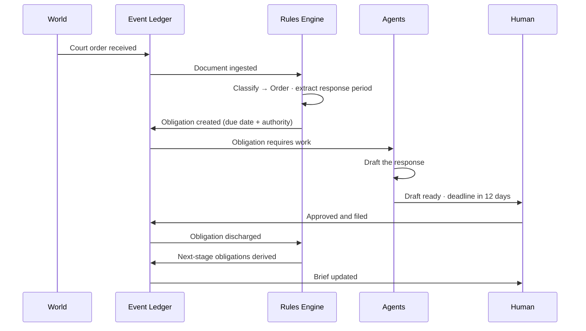

Every meaningful thing is an **immutable event**. Current state is a projection. This delivers, as a by-product rather than a feature, the four things CaseAce most conspicuously lacks: a complete audit trail, full history, point-in-time reconstruction, and the ability to explain *why* the system believes what it believes.

## 7.6 What becomes conversational

Conversation replaces navigation **for retrieval and instruction**, not for everything.

| Conversational | Remains visual |
| --- | --- |
| "What is due this week on the Cohen matters?" | The calendar |
| "Summarise where this file stands" | The obligation board |
| "Draft a response to paragraph 14" | Document comparison and redlines |
| "Which documents contradict the affidavit?" | The chronology |
| "Chase the outstanding discovery" | Financial dashboards |
| "What did we advise in March?" | Approval and signature surfaces |

**Design rule:** conversation for *retrieval, synthesis and instruction*; visual surfaces for *state, comparison and approval*. Dense state does not compress into dialogue, and consequential approvals must not be given by typing "yes."

## 7.7 What becomes autonomous under supervision

The taxonomy that governs deployment:

| Tier | Regime | Examples |
| --- | --- | --- |
| **T0 — Fully autonomous** | Acts, logs, no notification | Classification · metadata extraction · filing · indexing |
| **T1 — Autonomous, notified** | Acts, logs, informs | Deadline derivation · conflicts screening · chase messages · time proposals |
| **T2 — Draft, human adopts** | Produces, never sends | Pleadings · correspondence · client updates · extension applications |
| **T3 — Advisory only** | Informs, never acts | Risk assessment · strategy options · settlement analysis · red-team review |
| **T4 — Human only** | No AI output permitted | Advice to client · court advocacy · signature · fee agreements · matter acceptance |

**Three non-negotiable supervision invariants:**

1. **Attribution.** Every artifact records whether a human or an agent produced it, and which human is accountable. There is no anonymous output.
2. **Reversibility.** Every autonomous action is reversible, and the reversal is itself an event in the ledger.
3. **Explicability.** Every derived date, every flag and every recommendation states its authority. *"Due 14 October"* is unacceptable; *"Due 14 October — 30 days from service on 14 September under [rule], as verified by [name] on [date]"* is the minimum.

## 7.8 The 2026 system in one diagram

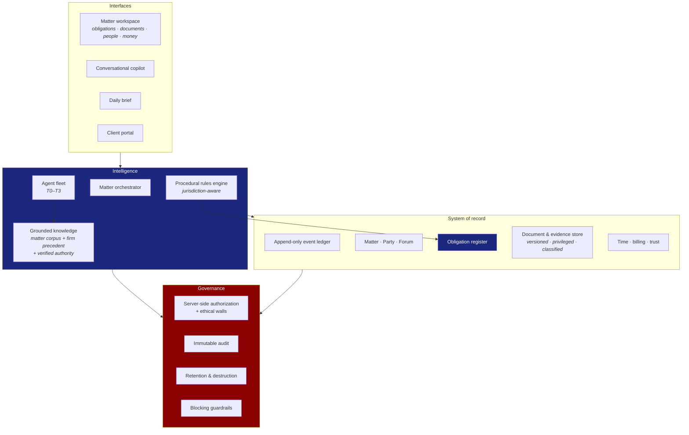

**Note what is central and what is peripheral.** The obligation register and the event ledger are the core. Screens are edge. Agents are a middle layer that reads the core and proposes to the edge. **CaseAce built only the edge** — which is why it looked like a product and behaved like a database.

---

# PHASE 8 — Rafter OS Gap Analysis

## 8.1 Framing the comparison

The two systems are **complementary halves of the same product**, and recognising this is the most actionable finding in the report.

Rafter OS, as it presently exists, is a **reasoning and production layer**: deep, jurisdiction-specific capability in Israeli civil litigation, insolvency, enforcement and insurance disputes — court-format document generation, evidence intelligence across large case files, contradiction and admission matrices, hearing preparation, adversarial review, citation discipline, and a house drafting standard. It produces work product of a quality CaseAce cannot approach.

CaseAce is a **coordination and record layer**: matters, people, calendars, task boards, document registers, a client portal and a notification spine. It produces no work product at all.

```mermaid
graph LR
    subgraph CA["CaseAce"]
        C1["Matter register"]
        C2["People & roles"]
        C3["Calendar & tasks"]
        C4["Document register"]
        C5["Client portal"]
        C6["Notifications"]
    end
    subgraph GAP["THE MISSING MIDDLE"]
        G1["<b>Obligation register</b>"]
        G2["<b>Event ledger</b>"]
        G3["<b>Controlled vocabulary</b>"]
        G4["<b>Server-side authz<br/>+ ethical walls</b>"]
    end
    subgraph RO["Rafter OS today"]
        R1["Court-format generation"]
        R2["Evidence intelligence"]
        R3["Contradiction & admission analysis"]
        R4["Hearing preparation"]
        R5["Citation & verification discipline"]
        R6["Adversarial review"]
    end
    CA -.->|"has no reasoning"| GAP
    GAP -.->|"has no memory"| RO
    style GAP fill:#1c277e,color:#fff
```

**The diagnosis in one sentence:** CaseAce has a memory with nothing to think about; Rafter OS has reasoning with nothing to remember. Neither is a firm operating system until the missing middle exists.

The practical consequence is that Rafter OS's current capabilities operate **per-invocation**: brilliant analysis of a case file, produced on request, that leaves no durable trace in a system of record. Nothing accumulates. The chronology built for last month's hearing must be rebuilt for this month's. Deadlines derived during preparation are not diarised anywhere. The knowledge is real; the persistence is not.

> **Assumption declared.** This phase assesses Rafter OS as inferable from its present capability surface. Where a judgement depends on internal architecture not visible to this engagement, it is marked *(assumption)*. Items so marked should be validated before being acted on.

## 8.2 Classification summary

| Class | Count | Meaning |
| --- | --- | --- |
| **KEEP** | 9 | Sound in CaseAce; adopt the concept unchanged |
| **IMPROVE** | 11 | Right idea, insufficient execution; adopt and deepen |
| **REPLACE** | 8 | Wrong approach to a real need; solve differently |
| **REMOVE** | 7 | Actively harmful or valueless; do not carry forward |
| **NEW** | 16 | Absent from both systems; must be built |

---

## 8.3 KEEP — adopt the concept as-is

| # | Asset | Why it survives | Rafter action |
| --- | --- | --- | --- |
| K1 | **Matter as organising principle** | Correct primitive; everything hangs off it | Foundation of the record layer |
| K2 | **Client as a first-class user** | Transparency is now expected; CaseAce had it in 2023 | Build the client portal early — it differentiates and it reduces chase load |
| K3 | **In-matter document request loop** | The best idea in the repository: in-context, object-based, self-discharging, provenance-preserving | Generalise into the universal `REQUEST` primitive — client documents, discovery, insurer disclosure, expert instruction |
| K4 | **Per-participant response state** | An invitation is an object with an independent lifecycle per person | Apply to hearings, meetings, and any multi-party obligation |
| K5 | **Role-nested navigation** | Strict subsets; learnable; correct shape | Keep the shape; change the axis to matter-first (see R2) |
| K6 | **Server-issued per-record permissions** | The one correct authorization pattern in the system | Generalise to every record and every tool call |
| K7 | **Acceptance criteria on delegated work** | Unusual and valuable; in an agent world it is the completion contract | Make it mandatory on every generated task — it is how an agent knows it is done |
| K8 | **Matter-scoped conversation** | The right container for collaboration and, later, for the copilot | Extend to include agent participation with clear attribution |
| K9 | **Observed-behaviour defaults** | The after-hours scheduling default shows real user observation | Adopt as a design value: defaults encode the observed common case |

---

## 8.4 IMPROVE — right idea, insufficient depth

| # | Asset | Gap | Rafter action |
| --- | --- | --- | --- |
| I1 | Case entity | No forum, parties, causes of action, dates, lifecycle or money | Expand to full **Matter**: court, instance, docket, judge, parties with per-matter roles, cause of action, claim value, procedural stage, limitation date, fee basis, lifecycle states |
| I2 | Document entity | No version, privilege, execution status, procedural type or retention | Add version chains, privilege classification, execution and filing state, **procedural taxonomy**, retention class, exhibit numbering |
| I3 | Document taxonomy | Generic office categories (passport, lease, EULA) | Replace with a **procedural** taxonomy: pleading, motion, affidavit, order, judgment, exhibit, discovery request/response, expert report, correspondence, filing receipt, POA, engagement letter |
| I4 | Appointment entity | No type, no case link, no conflict detection | Split: **Meeting** (soft, movable) versus **Hearing** (hard, consequential, with preparation chain) |
| I5 | Task entity | No matter link, no priority, no dependencies, no evidence | Reframe as a **projection of an Obligation**, inheriting matter, due date, authority and consequence |
| I6 | Notification | Purely retrospective; no read action; no channels | Replace with the attention engine (see N7) |
| I7 | Access-control list on documents | Exists and is unused | Activate as the substrate for **ethical walls** and need-to-know enforcement |
| I8 | Access log on documents | Exists; only the latest entry is read | Activate as the seed of the full audit ledger |
| I9 | Case member role | Concept correct, value hardcoded | Implement properly as **per-matter party role** — the same person may be client, witness and adverse director across different files |
| I10 | Dashboard | Counts, partly fabricated | Replace the artifact (see N8) but keep the insight that partners need a distinct surface |
| I11 | Empty states | Present on two screens, absent elsewhere | Universalise; make them **instructive**, offering the next action |

---

## 8.5 REPLACE — real need, wrong mechanism

| # | CaseAce approach | Replace with |
| --- | --- | --- |
| R1 | Free-text status, priority, type | **Controlled vocabularies** with defined lifecycle transitions, assigned by classifier and confirmed by human |
| R2 | Entity-first navigation (Cases · Documents · Tasks · People) | **Matter-first** information architecture, with entity views as secondary lenses and global semantic search |
| R3 | Hard delete as lifecycle | **Append-only ledger** with supersession, closure states, retention policy and scheduled destruction |
| R4 | Client-held role string | **Server-side, per-record, capability-based** authorization, ethical-wall aware, enforced identically for humans and agents |
| R5 | Manual deadline entry | **Derived obligations** from a jurisdiction-aware procedural rules engine, each stating its authority |
| R6 | Kanban board as the work surface | **Obligation board ordered by consequence**, with most items arriving pre-drafted |
| R7 | Third-party public document preview | **In-boundary rendering** under the application's own authentication — non-negotiable for privileged material |
| R8 | Manual hours integer | **Observed time events** with proposed entries and mandatory human approval |

---

## 8.6 REMOVE — do not carry forward

| # | Item | Reason |
| --- | --- | --- |
| X1 | Fabricated dashboard data | Fabricated metrics destroy trust in every real metric beside them |
| X2 | Placeholder table columns | A column that always shows the same string is worse than no column |
| X3 | Duplicate Client/Employee modules | One **Party** model with per-matter roles |
| X4 | Duplicate profile editors | Two implementations of one function is a governance failure, not a UI choice |
| X5 | Unreachable features | Ship it and link it, or do not ship it |
| X6 | Self-service registration | Legal systems are **invitation-only**; the firm provisions identity and matter access |
| X7 | Password material round-tripped to the client | Never return credential material to a browser under any circumstance |

---

## 8.7 NEW — absent from both systems

These are the build items. **N1–N4 are the missing middle** and are prerequisites for everything else.

| # | Capability | Priority | Why |
| --- | --- | --- | --- |
| **N1** | **Obligation register** — duty, source of law, due date, consequence of breach, owner, verification state | **P0** | The atomic unit of a legal OS. Everything else is a projection of it. Without it, Rafter OS remains per-invocation |
| **N2** | **Append-only event ledger** — every action, actor, authority and timestamp | **P0** | Delivers audit, history, point-in-time reconstruction and explicability as by-products |
| **N3** | **Procedural rules engine** — jurisdiction-aware date derivation | **P0** | Converts legal knowledge into computed, defensible dates. The highest-value engineering asset in the system |
| **N4** | **Server-side authorization with ethical walls** | **P0** | Precondition for holding privileged material at all, and for letting agents act |
| N5 | Conflicts checking with semantic party matching | **P0** | Ethical precondition to opening any matter |
| N6 | Limitation and prescription tracking, human-verified | **P0** | The highest-consequence date in litigation |
| N7 | Attention engine — predictive, consequence-ranked, multi-channel | **P0** | Replaces the notification feed; delivers the product's original promise |
| N8 | Generated daily brief | P1 | Replaces the counting dashboard with prose, prioritised, cited |
| N9 | Matter copilot — grounded, cited, refuses beyond the record | P1 | Turns the file from storage into a queryable colleague |
| N10 | Drafting pipeline with **blocking** citation verification | P1 | The largest labour displacement; unsafe without the guardrail |
| N11 | Client portal with matter-scoped, time-bounded access | P1 | Extends K2 into a governed capability |
| N12 | Time observation and billing | P1 | The firm must be able to be paid |
| N13 | Engagement, POA and intake pipeline | P1 | Currently manual in both systems |
| N14 | Filing integration with the relevant court e-filing system | P1 | Closes the loop from draft to filed; also the source of authoritative dates |
| N15 | Retention, destruction and disclosure management | P2 | Regulatory obligation, and a discovery-exposure control |
| N16 | Firm-wide precedent and knowledge accumulation | P2 | Turns each matter into a durable asset rather than a one-off effort |

## 8.8 Practice-specific gaps

For a practice centred on Israeli civil litigation, insolvency, enforcement and insurance disputes, four gaps are specific and material — and none is addressed by CaseAce in any form:

**Hebrew and RTL as a first-class requirement, not a localisation.** Matter records, party names, document content, generated work product and court-format output are Hebrew-primary with mixed-direction content (Hebrew prose containing Latin citations, numerals and file references). CaseAce is monolingual LTR throughout. This is not a translation task — it affects text storage, search, extraction, comparison, rendering, and every generated document. **Treat bidirectional correctness as an architectural constraint from the first commit**, because retrofitting it is disproportionately expensive.

**Jurisdiction-specific procedural rules.** The rules engine (N3) is only valuable if it encodes the actual procedural rules governing the forum — the service, response and appeal periods that determine every derived date. This is domain content, not code, and it must be **versioned and effective-dated**, because rules change and a date derived under a superseded rule must remain explicable after the change.

**Forum-specific filing and identifiers.** Court e-filing, enforcement-office procedures and insolvency filings each carry their own identifiers, formats and acknowledgement artifacts. The `FORUM` entity must be polymorphic across court instance, enforcement office and insolvency tribunal rather than assuming a single court model.

**Insurance and enforcement matter shapes.** These matters have structures a generic case record cannot hold: policy terms, coverage positions, loss adjuster assessments, deductibles and diminution calculations on one side; debtor, creditor, guarantor, writ type, asset registry and payment schedule on the other. **Matter should be an abstract type with practice-specific specialisations**, not a single flat record — this is the modelling decision that determines whether the system serves one practice area or many.

## 8.9 The integration thesis

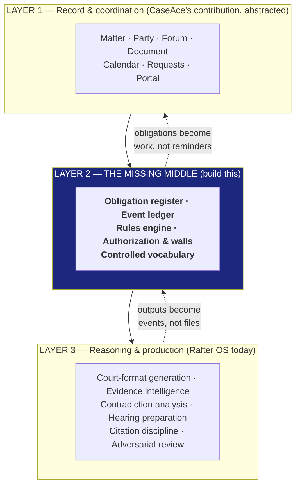

**The strategic recommendation.** Do not rebuild Layer 3 — it is Rafter OS's existing strength and its differentiator. Do not over-invest in Layer 1 — CaseAce demonstrates that a competent team builds it in six weeks, and it is the commodity part.

**Build Layer 2.** The obligation register, the event ledger and the rules engine are where the defensible value sits, because they are the only components that (a) require genuine legal-domain knowledge to specify, (b) accumulate value with every matter processed, and (c) make the reasoning layer *persistent* rather than per-invocation.

The single highest-leverage integration is narrow and specific: **make Rafter OS's analytical outputs write into an obligation register instead of returning as documents.** When hearing preparation derives a date, that date should become a tracked obligation with an owner and an escalation path — not a line in a memorandum that someone must remember to diarise. That one change converts a brilliant consulting tool into an operating system.

---

# PHASE 9 — Lesson Extraction: The Learning Map

CaseAce is an unusually good teaching asset precisely because it is **honestly imperfect at a legible scale**. It is small enough to read in a day, documented well enough to compare intent against outcome, and broken in ways that are *instructive rather than merely sloppy*. Its defects sit on real fault lines in software and legal-operations practice.

**Curriculum thesis:** the repository teaches one meta-lesson from which everything else follows —

> **A system is defined by its entities and their relationships, not by its screens. Every screen-level failure in CaseAce is a domain-model failure wearing a costume.**

## 9.1 Curriculum structure

| Module | Title | Duration | Core question |
| --- | --- | --- | --- |
| M1 | Reading a product from its artifacts | 3 h | What did they *intend*, and how do we know? |
| M2 | The domain model is the product | 4 h | Which absent field breaks which promise? |
| M3 | Workflows and the closed loop | 3 h | Why does every process here terminate? |
| M4 | Decision support versus data display | 3 h | Why is a correct dashboard still useless? |
| M5 | Authorization, confidentiality and professional risk | 3 h | Where does this become a malpractice event? |
| M6 | Conway's Law in the artifact | 2 h | How do you read team structure from source? |
| M7 | From coordination to reasoning | 4 h | What must exist before AI adds value? |
| M8 | Supervision architecture | 3 h | How much autonomy, under what accountability? |

---

## 9.2 Lessons

### L1 — Absence is the loudest signal
The fastest route to understanding a system is to list what it *cannot represent*. CaseAce cannot represent a hearing, a court, an opposing party, a limitation date or a closed case. Those five absences define the product more completely than any feature list.
*Transferable skill:* evaluate any system by attempting to express five domain-typical facts in it. What fails, defines it.

### L2 — A promise without an entity is marketing
"Never miss a court date" required a Hearing entity and a Deadline entity. Neither exists. **The objective was never translated into the model, so it could never be met** — and no amount of interface work could have saved it.
*Transferable skill:* trace every stated objective to the entity and relationship that would satisfy it. Untraceable objectives are decoration.

### L3 — Free text is a decision to have no data
`case_status` as a text box, with dashboards hardcoding three values, means analytics silently exclude records. **Uncontrolled vocabulary is not a shortcut; it is a decision to forgo aggregation, automation and retrieval forever.** In an AI-native system the cost multiplies, because vocabulary drift also degrades classification and search.

### L4 — Fork-and-rename is worse than copy-paste
The Task module is a 95%-renamed fork of Appointments; its analytics filter on a status tasks cannot hold and therefore report zero permanently. **A near-perfect rename passes code review precisely because it looks correct** — the residue is invisible until the semantics diverge in production.
*Transferable skill:* when forking, change the semantics deliberately and enumerate every assumption inherited from the source.

### L5 — Deletion is not a lifecycle
Cancelling deletes. Closing is unrepresentable, so closing deletes. For a regulated practice with retention duties and discovery exposure, this converts routine operation into evidence destruction. **Append-only is not an architectural luxury in professional services; it is a compliance floor.**

### L6 — The security boundary is wherever the server is
A role string in browser storage is not access control. The instructive part is that **two subsystems got it right** — proving the knowledge existed and was not generalised.
*Transferable skill:* find the minority-correct pattern in any codebase; it tells you what the team knew but did not have time to systematise.

### L7 — Fabricated data is contagious
Two of five dashboard charts render invented numbers. Once a user discovers one fabricated metric, **every metric beside it becomes untrustworthy** — including the correct ones. Demo data must never ship, and "TBD" is more valuable than a plausible lie.

### L8 — The interface reifies the data model
Navigation is entity-first (Cases, Documents, Tasks) because the model is entity-first with no matter-level joins. Users must mentally re-join what the schema failed to relate. **The UX defect and the modelling defect are the same defect.**

### L9 — Requirements degrade predictably under implementation pressure
The design specified a capability-based role model with an access array. The build produced scattered role conditionals. The design specified per-matter member roles; the build hardcoded a placeholder. **Unenforced relationships and unspecified enums are the first casualties**, every time. Build the enforcement infrastructure before the features that depend on it.

### L10 — Conway's Law is readable
Four contributors, four modules, two fork-duplications, zero integration. The orphaned-deadline defect exists because Cases, Tasks and Appointments were built in parallel by different people and nobody owned the joins. **Cross-cutting relationships need a cross-cutting owner.**

### L11 — Good ideas survive bad implementations
The document-request loop is genuinely innovative and remains valuable despite a delimiter-encoded payload. **Judge a product by the quality of its ideas separately from the quality of its execution** — they are independent variables, and the former is what you extract.

### L12 — AI cannot rescue a hollow model
No model can tell you a deadline is at risk if deadlines are not attached to matters. **AI amplifies a data model; it does not substitute for one.** This is the single most important lesson for anyone proposing to "add AI" to a legacy system.

---

## 9.3 Exercises

| # | Exercise | Duration | Deliverable |
| --- | --- | --- | --- |
| **E1** | **The absence audit.** Without reading this report, list every field a law firm needs that the system lacks. Then compare against Phase 2. | 90 min | Gap list + reflection on what you missed and why |
| **E2** | **Promise tracing.** Take the four README objectives. For each, identify the entities and relationships required. Mark satisfied / unsatisfiable. | 60 min | Traceability matrix |
| **E3** | **Enum reconstruction.** Design controlled vocabularies for case status, matter type, party role and document type — for a litigation practice. Define legal transitions. | 2 h | Vocabulary spec with state machine |
| **E4** | **The orphan fix.** Design the minimum schema change that links tasks and appointments to matters. Enumerate every screen, query and workflow affected. | 90 min | Migration design + blast-radius analysis |
| **E5** | **Obligation modelling.** Model a real procedural sequence — service, response, reply, disclosure — as derived obligations with authorities and consequences. | 3 h | Rules specification |
| **E6** | **Authorization redesign.** Convert the role ladder into the capability model the authors originally designed. Add ethical walls. | 2 h | Permission matrix + enforcement design |
| **E7** | **Dashboard inversion.** Replace the five counting charts with five decision-support surfaces. Justify each against a decision a partner makes. | 2 h | Dashboard spec |
| **E8** | **Request generalisation.** Abstract the document-request loop into a primitive serving four different collection scenarios. | 2 h | Interface design |
| **E9** | **Agent boundary drawing.** Assign every workflow in Phase 3 to tier T0–T4. Defend each boundary. | 90 min | Annotated allocation with rationale |
| **E10** | **The hostile review.** Argue that CaseAce is *good enough* for a three-lawyer firm. Then rebut yourself. | 90 min | Two-sided memo |

---

## 9.4 Live demonstrations

| # | Demonstration | Reveals |
| --- | --- | --- |
| **D1** | Create a case with status "In Review", then open the dashboard | The record vanishes from reporting. **Free text destroys analytics, silently** |
| **D2** | Create a task with a deadline, then open the case it belongs to | The task is nowhere. **The orphan defect, felt rather than described** |
| **D3** | Change the role value in browser storage, then reload | The interface promotes you. **Client-side authorization is theatre** |
| **D4** | Open the Task analytics chart | Permanent zero. **A fork's inherited assumption, failing in production** |
| **D5** | Book two appointments at the same time with the same attendee | Both are accepted. **No conflict detection** |
| **D6** | Accept an appointment, then have the creator move it a week | You remain "accepted" for a meeting you never saw. **State that should invalidate, and doesn't** |
| **D7** | Read every notification, then find what is due tomorrow | Impossible. **A notification system with no warnings** |
| **D8** | Attempt to close a case | The only option is deletion. **Deletion as lifecycle** |
| **D9** | Compare the prototype case grid to the shipped table | "Upcoming Activities" is missing. **Design regression caused by a modelling gap** |
| **D10** | Open a document preview and inspect where it renders | An external public service. **The confidentiality boundary, breached** |

> **Demonstration protocol.** D3 and D10 must be performed only against a local instance with synthetic data, and framed as defensive-security education. The purpose is teaching architectural reasoning about trust boundaries — never to exercise these techniques against a system you do not own.

---

## 9.5 Student challenges

| # | Challenge | Difficulty | Success criterion |
| --- | --- | --- | --- |
| **C1** | Design the Obligation entity and its rules engine for one procedural sequence | ●●●●○ | Given a trigger date, correctly derives the full obligation set with authorities |
| **C2** | Redesign the matter workspace so a lawyer can answer "what's next and why" in under five seconds | ●●●○○ | Passes a timed think-aloud test with a real practitioner |
| **C3** | Build the event ledger and prove point-in-time reconstruction | ●●●●○ | Any past state reproducible with full attribution |
| **C4** | Design the client portal with matter-scoped, time-bounded, revocable access | ●●●○○ | Access provably ends at matter closure |
| **C5** | Specify the citation-verification guardrail so no unverified authority can leave the system | ●●●●● | Cannot be bypassed; fails closed; logs every attempt |
| **C6** | Design bidirectional-text handling for mixed Hebrew/Latin legal documents | ●●●●○ | Correct storage, search, comparison and rendering |
| **C7** | Model Matter as an abstract type with litigation, insolvency and enforcement specialisations | ●●●●○ | Each holds its distinctive fields without polluting the base |
| **C8** | Build the attention engine: consequence-ranked, predictive, multi-channel | ●●●●○ | Beats chronological ordering on a practitioner-judged benchmark |

---

## 9.6 Discussion questions

**On product**
1. CaseAce delivered coordination and promised deadline safety. Is that dishonest, or is it the normal gap between vision and v1?
2. The client portal was ahead of its time. Why do most firms still not offer one?
3. Which is worse: a feature that does not exist, or a feature that displays fabricated data?

**On domain**
4. Is a legal matter fundamentally different from a software project, or only in degree? What follows either way?
5. Should obligation or matter be the atomic unit? Defend the alternative.
6. Every partner sees every matter. When is that correct, and when is it an ethical breach?

**On architecture**
7. The design was better than the build. Is that a process failure, an estimation failure, or an inevitability?
8. Two subsystems implemented authorization correctly. Why did the pattern not spread?
9. Event sourcing gives audit, history and explicability for free — but costs complexity. Where is the threshold?

**On AI**
10. Which is riskier: an AI that computes a limitation date wrongly, or a human who forgets to compute one at all?
11. If an agent drafts a pleading and a lawyer signs it unread, who is responsible? Does the system's design change the answer?
12. Should an AI be permitted to *close* an obligation, or only to propose closure?
13. What must be true of a system before adding AI creates value rather than risk?

**On ethics and professional responsibility**
14. Hard deletion in a system holding litigation records — negligence, or an ordinary product decision?
15. Rendering privileged documents through a public third-party viewer: whose duty was breached?
16. If a system silently excludes matters from a risk dashboard because of a vocabulary mismatch, and a deadline is missed — where does liability sit?

---

## 9.7 Reverse-engineering exercises

| # | Exercise | Method | Skill developed |
| --- | --- | --- | --- |
| **RE1** | Reconstruct the data model from the interface alone, without reading source | Screen and form inspection | Inferring schema from surface |
| **RE2** | Reconstruct the API surface from network traffic | Observation of calls | Inferring contracts from behaviour |
| **RE3** | Infer team structure and division of labour from source alone, then verify against version history | Duplication and naming analysis | Reading Conway's Law |
| **RE4** | Date the project to within a quarter using only dependencies and idioms | Technology archaeology | Temporal inference |
| **RE5** | Identify every place design intent survived and every place it degraded | UML-to-code comparison | Specification drift detection |
| **RE6** | Find every piece of fabricated data without running the application | Static inspection | Distinguishing real from demo |
| **RE7** | Map the trust boundaries and mark every crossing | Data-flow analysis | Security architecture reasoning |
| **RE8** | Reconstruct the product roadmap the team would have written next | Backlog inference from stubs and placeholders | Reading intent from incompleteness |

---

## 9.8 Prompt-engineering opportunities

CaseAce is an excellent substrate for teaching AI-assisted legal work, because it supplies **realistic structure with no confidential content**.

| # | Opportunity | Teaching value |
| --- | --- | --- |
| **P1** | Given the entity list, generate the missing legal fields; compare against Phase 2 | Domain elicitation; measuring model legal knowledge |
| **P2** | Given a free-text status column, propose a controlled vocabulary with transitions | Structure induction from messy data |
| **P3** | Given a matter type and jurisdiction, derive the obligation set with authorities | **Grounding and citation discipline — the central skill** |
| **P4** | Given a document, classify into a procedural taxonomy and extract obligations | Extraction with verifiable ground truth |
| **P5** | Given a matter record, draft a client status update in plain language | Audience adaptation; register control |
| **P6** | Given a draft with fabricated citations, build a prompt that reliably catches them | **Adversarial verification — the highest-value legal-AI skill** |
| **P7** | Given the notification taxonomy, generate the predictive counterpart | Inverting a mental model |
| **P8** | Given a case file, produce a chronology with a citation for every entry | Grounded synthesis; refusal behaviour |
| **P9** | Design a system prompt for a matter copilot that must refuse beyond the record | **Constraint design; teaching refusal as a feature** |
| **P10** | Red-team your own generated pleading as opposing counsel | Adversarial self-review |

**The pedagogical core is P3, P6 and P9.** They train the discipline that separates useful legal AI from dangerous legal AI: *ground every claim, verify every authority, refuse beyond the record.*

---

## 9.9 Architecture discussions

| # | Topic | Tension |
| --- | --- | --- |
| **AD1** | Event sourcing versus CRUD | Audit, history and explicability for free, against real complexity and query cost. Where is the line for a 20-person firm? |
| **AD2** | Monolith versus modules | Four parallel modules produced two forks and zero joins. Would a monolith have prevented it, or merely relocated it? |
| **AD3** | Rules engine versus hardcoded logic | Procedural rules change and must be versioned and effective-dated. What does that cost, and who maintains it? |
| **AD4** | Where does authorization live? | Client, server, database, or policy engine? What does agent access change about the answer? |
| **AD5** | Conversational versus structured interfaces | What genuinely compresses into dialogue, and what must remain visual? |
| **AD6** | Grounding architecture | Retrieval, fine-tuning, or long context for matter-scoped reasoning? How is groundedness *enforced* rather than requested? |
| **AD7** | Agent autonomy boundaries | Who decides tier assignment? Can it change per client, per matter, per risk level? |
| **AD8** | Multi-tenancy and confidentiality | Ethical walls, per-matter isolation, and the question of whether one client's data may ever inform another's matter |
| **AD9** | Bidirectional text as architecture | Why RTL is a data-layer concern, not a CSS concern |
| **AD10** | Build versus buy for Layer 1 | If commodity coordination takes six weeks, why build it at all? |

---

# PHASE 10 — Knowledge Extraction: The Reusable Asset Library

*Abstractions only. No implementation is carried forward. Each pattern is stated so it can be re-expressed from first principles on any stack.*

## 10.1 Business patterns

**BP-1 — The tri-perspective system.** One matter record, three coherent perspectives: firm operator (portfolio, capacity, revenue), matter worker (my work, my deadlines), matter participant (my case, what is needed from me). Not three products — one model, three projections. *Origin: CaseAce's role-nested navigation, generalised.*

**BP-2 — The client as participant, not recipient.** Clients do work: they supply documents, answer questions, make decisions, approve strategy. A system that treats the client as a read-only audience discards the cheapest available labour and the fastest available information. *This is CaseAce's most under-appreciated insight.*

**BP-3 — Obligation-first practice management.** The law imposes obligations; obligations have dates, authorities and consequences; work exists to discharge them. Model obligations first, derive tasks and calendar entries from them. *The inverse of CaseAce's approach, and the correction that defines the category.*

**BP-4 — Closed-loop collection.** Any request for something from someone should be an object with a due date, a chase policy, an arrival validation and a visible resolution. *Origin: the document-request loop, generalised.*

**BP-5 — Vocabulary as infrastructure.** Controlled vocabularies with defined transitions are a precondition for analytics, automation, retrieval and AI. Treat them as schema, govern them centrally, version them. *Origin: the failure of free-text status.*

**BP-6 — Instrument before you improve.** Ship the measurement with the feature. A system that cannot demonstrate its effect cannot be justified, tuned, or safely automated. *Origin: the total instrumentation gap.*

**BP-7 — Practice-specific specialisation over one flat record.** Matter as an abstract type with specialisations per practice area — each holding its distinctive structure without polluting the base. *Origin: the failure of a single generic Case record to serve any real practice.*

## 10.2 UX patterns

**UX-1 — The workspace, not the record view.** For the central object, build a place where work happens — context, conversation, evidence and next actions together — rather than a page that displays fields.

**UX-2 — Strict-subset role navigation.** Each role's navigation is a proper subset of the tier above. Learnable, explicable, and it makes permission reasoning visible in the interface itself.

**UX-3 — Matter-first information architecture.** Primary navigation follows how practitioners think (this file), not how the database is organised (all documents). Entity views are secondary lenses.

**UX-4 — In-context request-and-fulfil.** Requests appear where the conversation is, resolve where they appear, and leave provenance behind.

**UX-5 — State-encoding visual language.** Colour, iconography and typography encode *state and consequence*, not decoration. *Origin: the calendar's response-state colouring — the best information design in the product.* Always pair with a non-colour channel for accessibility.

**UX-6 — Observed-behaviour defaults.** Defaults encode the empirically common case. *Origin: the after-hours scheduling default.*

**UX-7 — Explain the denial.** Never silently hide an unavailable action. Disable it and state why, and who can grant it. *Origin: CaseAce's silent hiding.*

**UX-8 — Instructive empty states.** An empty state should teach the next action, not merely report emptiness.

**UX-9 — Consequence-ranked attention.** Order by what happens if ignored, never by recency. *Origin: the undifferentiated notification feed.*

**UX-10 — Numbers travel with their comparison.** Never display a metric without its trend, target or threshold. A naked number is not information. *Origin: every metric tile in the product.*

**UX-11 — Conversation for retrieval, surfaces for approval.** Dialogue for synthesis and instruction; visual, deliberate surfaces for consequential decisions.

## 10.3 Workflow patterns

**WF-1 — Derive, don't ask.** If the system can compute it from what it already knows, it must not ask a human to type it. *The single highest-value workflow principle.*

**WF-2 — Every completion emits an event.** Finishing something should unblock, trigger, record and bill. *Origin: CaseAce's terminating workflows.*

**WF-3 — Draft-first execution.** For any generatable artifact, the system attempts it and the human reviews. Converts the human's job from production to judgement.

**WF-4 — Escalation as a first-class policy.** Every obligation carries a chase and escalation policy. Silence is a state that must trigger action.

**WF-5 — Acceptance criteria as contract.** Delegated work states its completion condition. Essential for human review; **mandatory for agent self-verification.**

**WF-6 — Approve, never auto-commit, for consequential output.** Anything reaching a client, a court or an invoice requires named human adoption.

**WF-7 — Reversibility by default.** Every automated action is reversible, and the reversal is itself recorded.

## 10.4 Entity model (reference abstraction)

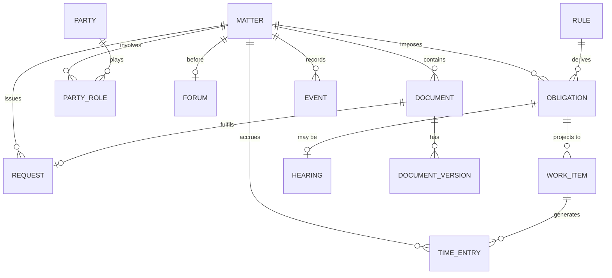

**The seven modelling rules extracted from CaseAce's failures:**

1. **Everything dated belongs to a matter.** No orphan deadlines, ever.
2. **Every classification is a controlled vocabulary.** No free-text enums.
3. **Every role is contextual.** A person's role is per matter, not global.
4. **Every state change is an event.** Append-only; state is a projection.
5. **Every date states its authority.** A derived date without its source is unusable and indefensible.
6. **Every document has a procedural type, a version and a privilege class.**
7. **Nothing is deleted.** Supersede, close, archive, destroy under policy — never delete.

## 10.5 Dashboard concepts

| Concept | Principle |
| --- | --- |
| **The generated brief** | Prose over charts for the daily surface: what changed, what is at risk, what needs you, what was handled |
| **The risk board** | Everything at risk, ranked by consequence × proximity, across all matters |
| **Matter health** | Progression, stall detection, responsiveness, budget variance — per file |
| **Capacity** | Real workload from obligations, not headcount from a directory |
| **Client health** | Responsiveness, sentiment, outstanding requests, time since contact |
| **Economics** | WIP, realisation, collection, write-offs, profitability by matter type |

**Governing rule: a dashboard exists to change a decision.** If no decision changes as a result of viewing it, delete it. CaseAce's dashboard fails this test on all five charts.

## 10.6 Navigation concepts

| Concept | Principle |
| --- | --- |
| Matter-first primary IA | Navigate to a file, not to a table |
| Entity views as lenses | Cross-matter views are secondary, filtered projections |
| Persistent role-scoped rail | Strict subsets, active-state indication |
| Global semantic search | One input, all matters, natural language, permission-filtered |
| Recents and pinned matters | Practitioners work a small hot set — make it one click |
| Command surface | Keyboard-first action invocation for power users |
| Context preservation | Moving between views retains matter scope |
| Deep-linkable everything | Every object addressable, shareable and citable |

## 10.7 Role model (reference abstraction)

**Two orthogonal layers — the model CaseAce designed and failed to build:**

*Organisational roles* (who someone is): Firm Administrator · Partner · Associate · Paralegal · Support · Client · External Counsel · Expert.

*Capabilities* (what someone may do): View · Create · Edit · Delete · Assign · **Request** *(place an obligation on another party)* · Approve · Sign · Bill · Administer.

*Scopes* (over what): Global · Practice group · Matter · Own work.

**Composition:** a permission is a capability, over a scope, granted to a role or an individual, subject to ethical walls, evaluated server-side, applied identically to humans and to agents acting on their behalf.

**Three rules extracted:**
1. **Capabilities compose; role ladders do not.** Build capability infrastructure before features that need it, or it will degrade into `if` statements. *This is the documented regression in CaseAce.*
2. **Scope is as important as capability.** "Can edit" is meaningless without "which matters".
3. **Agents inherit, never exceed.** An agent's authority is exactly the invoking human's authority, and every exercise is attributed to that human.

## 10.8 Security and governance concepts

| # | Concept | Statement |
| --- | --- | --- |
| **SEC-1** | Server-side authorization only | The client is a rendering surface. Every decision is made and enforced server-side, per record |
| **SEC-2** | Ethical walls as infrastructure | Matter-level confidentiality that overrides role. Screened personnel cannot see screened matters — enforced, not conventional |
| **SEC-3** | Privilege as a data attribute | Every document carries a privilege classification that governs access, disclosure and export |
| **SEC-4** | Append-only by default | No hard deletes. Supersession, closure, retention and policy-driven destruction with recorded authority |
| **SEC-5** | Complete audit | Every read of privileged material, every write, every agent action — actor, time, authority, justification |
| **SEC-6** | Confidentiality boundary integrity | Privileged content never renders, transits or is processed outside the trust boundary. *Origin: the third-party document viewer* |
| **SEC-7** | Invitation-only identity | The firm provisions accounts, roles and matter access. No self-service registration |
| **SEC-8** | Time-bounded client access | Client access is matter-scoped and expires at matter closure, automatically |
| **SEC-9** | Credential material never leaves the server | No password value returns to any client under any circumstance |
| **SEC-10** | Blocking guardrails | Safety controls prevent, not warn. Unverified citations do not produce an advisory — they prevent release |
| **SEC-11** | Attribution on every artifact | Human or agent, and which accountable human. No anonymous output |
| **SEC-12** | Explicability of derived facts | Every computed date, flag or score states its authority and inputs. Unexplainable outputs are unusable in a professional context |

---

# Closing

## The three sentences that matter

**CaseAce is a competent coordination system that modelled a law firm as a software team, and its most instructive property is that three of its four headline promises were unbuildable on the domain model it chose.**

**Its enduring assets are not code but decisions: the matter as organising principle, the client as a first-class participant, the closed-loop document request, per-participant response state, strict-subset role navigation, and acceptance criteria on delegated work.**

**Its central lesson for Rafter OS is that reasoning without persistence is consulting, and persistence without reasoning is filing — the defensible product is the missing middle: an obligation register, an event ledger, a procedural rules engine, and an authorization model strong enough to let agents act.**

## What to do with this document

| Audience | Use |
| --- | --- |
| **Product** | Phase 8 is the backlog. N1–N4 are the foundation; nothing else should start first |
| **Architecture** | Phases 7 and 10.4 are the target model. Phase 10.8 is the non-negotiable control set |
| **Design** | Phases 4–5 are the anti-pattern catalogue; 10.2 and 10.6 are the pattern library |
| **AI/ML** | Phase 6 is the roadmap. The sequencing rule — *never ship leverage before safety* — governs |
| **Teaching** | Phase 9 is a ready curriculum: 8 modules, 12 lessons, 10 exercises, 10 demonstrations, 8 challenges, 16 discussion questions |
| **Legal & risk** | Section 0.1 governs reuse. Phase 10.8 is the control framework |

## Method note

This analysis was performed by reading the public repository, its documentation and its design artifacts. **No code was copied, no derivative work was created, and nothing was contributed upstream.** Every asset in Phase 10 is an abstraction stated at a level that must be independently re-implemented. Identifiers appearing in this report are cited as evidence of design decisions, in the manner of quotation for analysis — not as components for transplant. The licence position is set out in Section 0.1 and should be reviewed by counsel before any implementation work proceeds.
